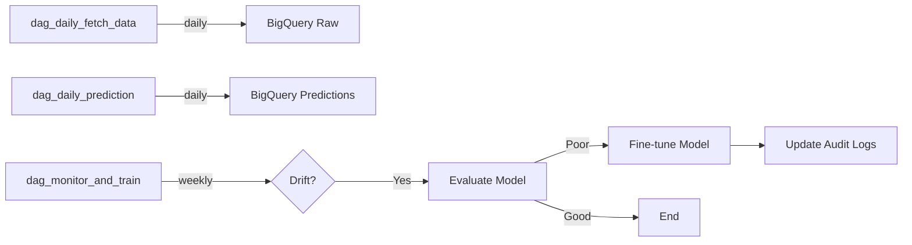

# 🎯 MLOps Roadmap — Bike Traffic Prediction

**Date limite soutenance** : 7 novembre 2025
**Branche principale** : `feat/mlops-integration`

---

## 📊 État actuel (Phases 0-1 complétées ✅)

- ✅ Modèles ML entraînés (RF, NN)
- ✅ MLflow tracking opérationnel (dev/prod)
- ✅ Registry custom via `summary.json` GCS
- ✅ Backend FastAPI déployé sur Cloud Run (regmodel uniquement)
- ✅ Frontend Streamlit déployé
- ✅ Docker + docker-compose pour dev local
- ✅ Environnements dev/prod séparés

---

## 🚀 Phases MLOps à implémenter

### **Phase 2 : Tests, CI & Data Versioning**

#### **2.1 Data Versioning with DVC** (`feat/mlops-dvc-data-versioning`) ✅

**Implementation completed** ✅

📚 **Full documentation**: [docs/dvc.md](docs/dvc.md)

**Deliverables** ✅:

- ✅ Temporal split: reference (660K rows, 69.7%) + current (288K rows, 30.3%)
- ✅ DVC tracking with GCS remote storage
- ✅ `scripts/split_data_temporal.py` implemented

---

#### **2.2 Tests unitaires + CI** (`feat/mlops-tests-ci`) ✅

**Implementation completed** ✅

📚 **Full documentation**:

- [docs/pytest.md](docs/pytest.md) - Complete test suite
- [docs/ci.md](docs/ci.md) - CI/CD with GitHub Actions + Codecov

**Deliverables** ✅:

- ✅ **47 tests** passing (13 pipelines + 17 preprocessing + 11 API + 6 registry)
- ✅ **68% coverage** (app/classes: 73.42%, model_registry: 56.31%)
- ✅ GitHub Actions CI configured with **UV**
- ✅ Codecov integration active ([dashboard](https://app.codecov.io/gh/arthurcornelio88/bike-count-prediction-app))
- ✅ Coverage artifacts (HTML reports, 30 days retention)

**Files created**:

```text
tests/
├── test_pipelines.py          ✅ 13 tests (RF, NN)
├── test_preprocessing.py      ✅ 17 tests (transformers)
├── test_api_regmodel.py       ✅ 11 tests (FastAPI /predict)
├── test_model_registry.py     ✅ 6 tests (summary.json logic)
├── conftest.py                ✅ Shared fixtures
pytest.ini                     ✅ Configuration
.github/workflows/ci.yml       ✅ GitHub Actions
.coveragerc                    ✅ Coverage config
```

---

#### **2.3 Backend API `/train` + MLflow Integration** (`feat/mlops-tests-ci`) ✅

**Implementation completed** ✅

📚 **Documentation**:

- [docs/backend.md](docs/backend.md#train---train-and-upload-model)
- [docs/training_strategy.md](docs/training_strategy.md) — Hybrid training workflow
- [docs/mlflow_cloudsql.md](docs/mlflow_cloudsql.md) — Cloud SQL setup

**Objectifs** :

- ✅ Refactor training logic into unified `train_model()` function
- ✅ Create FastAPI `/train` endpoint for remote training
- ✅ Integrate MLflow tracking in docker-compose stack
- ✅ **MLflow Cloud SQL backend** for centralized team collaboration
- ✅ Support DVC-tracked datasets (reference/current)
- ✅ Automatic GCS upload + `summary.json` update

**Deliverables** ✅:

- ✅ `train_model()` function in [train.py:256](backend/regmodel/app/train.py#L256)
- ✅ Docker Compose MLflow server + Cloud SQL Proxy
- ✅ **Cloud SQL PostgreSQL** backend (`mlflow-metadata` instance)
- ✅ UV-optimized Dockerfile ([backend/regmodel/Dockerfile](backend/regmodel/Dockerfile))
- ✅ Dedicated pyproject.toml for RegModel service
- ✅ MLflow tracking already integrated in `train_rf()`, `train_nn()`, `train_rfc()`

**Architecture**:

```yaml
services:
  cloud-sql-proxy:
    - Proxies connection to Cloud SQL PostgreSQL
    - Instance: datascientest-460618:europe-west3:mlflow-metadata
    - Requires: roles/cloudsql.client on service account

  mlflow:
    - Tracking server on port 5000
    - Backend store: Cloud SQL PostgreSQL (metadata)
    - Artifact store: gs://df_traffic_cyclist1/mlflow-artifacts/
    - Benefits: Shared team tracking, persistent, scalable
```

**Supported models**:

- `rf`: Random Forest regressor
- `nn`: Neural Network regressor
- `rf_class`: Random Forest classifier (affluence detection)

**Métriques trackées** (aligné avec `summary.json`) :

- **Régression (RF, NN)** : `r2_train`, `rmse_train`
- **Classification (RFC)** : `accuracy`, `precision`, `recall`, `f1_score`
- **Hyperparams** :
  - RF: `n_estimators`, `max_depth`, `random_state`
  - NN: `embedding_dim`, `batch_size`, `epochs`, `total_params`

**Validation completed** ✅:

- ✅ MLflow stack : `docker compose up` works
- ✅ MLflow UI accessible at <http://localhost:5000>
- ✅ Cloud SQL proxy connection verified (europe-west3)
- ✅ Service account permissions configured (`roles/cloudsql.client`)
- ✅ Test mode (`test_mode=true`) working with `test_sample.csv`
- ✅ Metrics correctly returned in API response (RMSE, R²)
- ✅ MLflow tracking confirmed (runs, metrics, tags, artifacts to GCS)

#### **2.4 Test `/train` Endpoint** ✅

**Status**: ✅ Complete - Endpoint tested and working in docker-compose stack

**Quick Test:**

```bash
# Test with docker-compose stack
docker compose up -d
curl -X POST "http://localhost:8000/train" \
  -H "Content-Type: application/json" \
  -d '{"model_type":"rf","data_source":"baseline","test_mode":true,"env":"dev"}'
```

**Expected Response**: JSON with `run_id`, `metrics` (rmse, r2), and `model_uri`

**Verification Checklist:**

- ✅ `/train` endpoint working in docker-compose stack
- ✅ MLflow tracking to Cloud SQL backend
- ✅ Artifacts stored in GCS (`gs://df_traffic_cyclist1/mlflow-artifacts/`)
- ✅ `summary.json` appended to GCS
- ✅ Test mode (`test_mode=true`) working with fast training

**Ready for**: Airflow DAG 3 (`dag_monitor_and_train.py`) integration

---

### **Phase 3 : Orchestration Airflow + Monitoring Production** (`feat/mlops-airflow-pipeline`)

**Status**: 🔄 In Progress (DAG 2/3 Complete ✅)

**Progress Summary:**

- ✅ MLflow Cloud SQL backend configured (team collaboration enabled)
- ✅ Airflow stack deployed via docker-compose (WSL2 + Mac multi-platform support)
- ✅ **DAG 1/3 COMPLETE**: `dag_daily_fetch_data.py` - Data ingestion with deduplication
- ✅ **DAG 2/3 COMPLETE**: `dag_daily_prediction.py` - ML predictions with drift handling
- ⏳ **DAG 3/3 PENDING**: `dag_monitor_and_train.py` - Next priority
- ✅ BigQuery datasets: `bike_traffic_raw` (raw data), `bike_traffic_predictions` (predictions)
- ✅ BigQuery partitioned table architecture implemented (`comptage_velo`)
- ✅ Data drift handling in ML API (unknown compteurs fallback)
- ⏳ Prometheus + Grafana monitoring pending

**Objectifs unifiés** :

- 🔄 Pipeline automatisé end-to-end avec Airflow
- 📊 Monitoring avec BigQuery (raw, predictions, audit)
- 🔍 Drift detection avec Evidently
- 🎯 Réentraînement intelligent via endpoint `/train` (fine-tuning)
- 📈 Métriques API avec Prometheus + Grafana
- 🔒 Sécurité API (API Key + Rate Limiting)

**Data Strategy** (Updated 2025-10-11) ✅:

After data quality validation, we identified that all data sources (reference_data.csv,
current_data.csv, current_api_data.csv) are from the same origin (Paris Open Data historical
exports) with perfect correlation (r=1.0, MAE=0).

**Final Decision**: Use `current_api_data.csv` (905k records, 2024-09-01 → 2025-10-10) as unified baseline:

- 80% Train: ~724k records (2024-09 → 2025-08)
- 20% Test: ~181k records (2025-08 → 2025-10)
- Live API ingestion starting 2025-10-11 (cutoff date)
- Weekly drift detection + conditional fine-tuning

📚 **Full documentation**: [docs/fetch_data_strategy.md](docs/fetch_data_strategy.md)

---

#### **3.1 Data Preparation & Baseline** ✅

**Baseline Creation**:

```bash
# Split current_api_data.csv into train/test (80/20 split)
python scripts/split_data_temporal.py

# Output:
# - data/train_baseline.csv (~724k records, 2024-09-01 → 2025-08-15)
# - data/test_baseline.csv (~181k records, 2025-08-16 → 2025-10-10)
```

**GCS Upload** (baseline for champion model training):

```bash
# Upload train_baseline.csv to GCS
gsutil -m cp data/train_baseline.csv gs://<your-bucket>/data/train_baseline.csv

# Verify upload
gsutil ls -lh gs://<your-bucket>/data/
```

**DVC Tracking** (optional - for local versioning):

```bash
dvc add data/train_baseline.csv data/test_baseline.csv
dvc push
git add data/*.dvc .dvc/config
git commit -m "chore: add new baseline from current_api_data"
```

---

#### **3.1.5 Training Strategy** (Hybrid Architecture)

**Architecture**: Local champion training + Production fine-tuning

| Component | Where | When | Data Size | Duration |
|-----------|-------|------|-----------|----------|
| **Champion Training** | 💻 Local | One-time (+ quarterly) | 724k records | 15-30 min |
| **Fine-Tuning** | ☁️ Production | Weekly (if drift) | 2k records | 5-10 min |
| **Evaluation** | ☁️ Production | Weekly | 181k test set | 2-3 min |
| **Inference** | ☁️ Production | Daily | 100 records | <1 sec |

**Workflow**:

```text
┌─────────────────────────────────────────────────────────┐
│ INITIAL SETUP (Local - One Time)                       │
├─────────────────────────────────────────────────────────┤
│ 1. Train champion_v1 on train_baseline.csv (local)     │
│ 2. Evaluate on test_baseline.csv → MAE: ~12            │
│ 3. Upload to GCS + MLflow registry                     │
│ 4. Deploy to Cloud Run API                             │
└─────────────────────────────────────────────────────────┘
                        ↓
┌─────────────────────────────────────────────────────────┐
│ PRODUCTION (Weekly DAG)                                 │
├─────────────────────────────────────────────────────────┤
│ 1. Fetch last 7 days from BigQuery                     │
│ 2. Drift detection (Evidently vs test_baseline)        │
│ 3. If NO drift → skip, keep champion                   │
│ 4. If drift → fine-tune on last 30 days                │
│ 5. Evaluate challenger on SAME test_baseline.csv       │
│ 6. Champion/Challenger decision (5% threshold)         │
│ 7. Log metrics to monitoring_audit.logs                │
└─────────────────────────────────────────────────────────┘
                        ↓
┌─────────────────────────────────────────────────────────┐
│ QUARTERLY RETRAIN (Local - Every 3 months)             │
├─────────────────────────────────────────────────────────┤
│ 1. Download all BigQuery data (3 months)               │
│ 2. Merge with train_baseline.csv → new_train.csv       │
│ 3. Retrain champion_v2 locally (full training)         │
│ 4. Evaluate on SAME test_baseline.csv                  │
│ 5. If improved → deploy as new champion                │
└─────────────────────────────────────────────────────────┘
```

**Key Decisions**:

- **Local training**: Full champion model on complete baseline (724k records)
- **Production fine-tuning**: Lightweight adaptation on recent data (30 days, ~2k records)
- **Fixed test set**: Always evaluate on same test_baseline.csv for valid comparison
- **Champion/Challenger**: Promote only if 5% MAE improvement on test set

📚 **Full strategy**: [docs/training_strategy.md](docs/training_strategy.md)

---

#### **3.2 Architecture BigQuery** ✅

**3 Datasets pour traçabilité complète** :

```yaml
# Structure BigQuery
datascientest-460618:
  bike_traffic_raw:           # ✅ Données brutes (IMPLEMENTED)
    - comptage_velo           # ✅ Table unique partitionnée par date

  bike_traffic_predictions:   # ⏳ Prédictions quotidiennes (PENDING)
    - daily_YYYYMMDD          # Prédictions + scores de confiance
    - prediction_ts           # Timestamp de prédiction

  monitoring_audit:           # ⏳ Logs de monitoring (PENDING)
    - logs                    # Audit complet (drift, AUC, fine-tuning)
```

**Schema des tables** :

```python
# ✅ bike_traffic_raw.comptage_velo (IMPLEMENTED)
# Single partitioned table (NOT daily tables)
{
    "comptage_horaire": INTEGER,               # Hourly bike count
    "date_et_heure_de_comptage": TIMESTAMP,    # Date/time (PARTITION FIELD)
    "identifiant_du_compteur": STRING,         # Counter ID (CLUSTERING FIELD)
    "nom_du_compteur": STRING,                 # Counter name
    "latitude": FLOAT,                         # GPS latitude (extracted from coordinates)
    "longitude": FLOAT,                        # GPS longitude (extracted from coordinates)
    "ingestion_ts": TIMESTAMP                  # When record was ingested
}
# Partitioning: Daily partitions on date_et_heure_de_comptage
# Clustering: By identifiant_du_compteur for efficient queries
# Write mode: APPEND with deduplication logic

# ⏳ bike_traffic_predictions.daily_YYYYMMDD (PENDING - DAG 2)
{
    "comptage_horaire": INTEGER,          # Valeur réelle (si disponible)
    "prediction": FLOAT,                   # Prédiction du modèle
    "model_type": STRING,                  # rf, nn, rf_class
    "model_version": STRING,               # Timestamp du modèle
    "prediction_ts": TIMESTAMP
}

# ⏳ monitoring_audit.logs (PENDING - DAG 3)
{
    "timestamp": TIMESTAMP,
    "drift_detected": BOOLEAN,
    "rmse": FLOAT,
    "r2": FLOAT,
    "fine_tune_triggered": BOOLEAN,
    "fine_tune_success": BOOLEAN,
    "model_improvement": FLOAT,            # Δ R²
    "env": STRING,
    "error_message": STRING
}
```

**Key Architecture Decisions:**

- **Single partitioned table** instead of daily tables (better for queries, easier maintenance)
- **Deduplication logic** prevents duplicate insertions on DAG reruns
- **Clustering by counter ID** optimizes queries filtering by specific counters
- **Idempotent design** allows safe reruns without data duplication

---

#### **3.2 DAGs Airflow (Architecture modulaire)**

**3 DAGs séparés pour isoler les responsabilités** :



**Status**: DAG 1 ✅ Complete | DAG 2 ⏳ Next | DAG 3 ⏳ Pending

**📁 Structure des fichiers** :

```text
dags/
├── dag_daily_fetch_data.py          # ✅ Ingestion données brutes → BigQuery (DONE)
├── dag_daily_prediction.py          # ⏳ Prédictions via /predict → BigQuery (NEXT)
├── dag_monitor_and_train.py         # ⏳ Drift + Eval + Fine-tuning (PENDING)
└── utils/
    ├── bike_helpers.py               # ✅ Fonctions BigQuery, GCS
    └── env_config.py                 # ✅ Config ENV/PROD avec Secret Manager
```

**DAG Implementation Status:**

| DAG | Status | Documentation | Tested | Notes |
|-----|--------|---------------|--------|-------|
| `dag_daily_fetch_data.py` | ✅ Complete | ✅ [docs/dags.md](docs/dags.md#1-daily-fetch-bike-data-dag) | ✅ Yes | Idempotent, deduplication, partitioned table |
| `dag_daily_prediction.py` | ✅ Complete | ✅ [docs/dags.md](docs/dags.md#2-daily-prediction-dag) | ✅ Yes | ML predictions, drift handling, R²=0.79 |
| `dag_monitor_and_train.py` | ⏳ Pending | ⏳ Pending | ⏳ No | Drift detection + conditional fine-tuning |

---

#### **3.3 DAG 1 : Ingestion des données** (`dag_daily_fetch_data.py`) ✅ **COMPLETE**

**Status**: ✅ Implemented, Tested, Documented

**Objectif** : Récupérer les données de trafic cycliste depuis l'API Paris Open Data et stocker dans BigQuery

**Key Features Implemented:**

- ✅ API pagination (100 records/page, up to 1000 total)
- ✅ Deduplication logic (queries max existing date, filters duplicates)
- ✅ Single partitioned table (`comptage_velo`) instead of daily tables
- ✅ Data transformations (coordinates → lat/lon, date → TIMESTAMP)
- ✅ Idempotent design (safe to rerun multiple times)
- ✅ Validation task with graceful "no new data" handling

**Architecture:**

```text
Paris Open Data API
    ↓ (pagination: 10 pages × 100 records)
fetch_to_bigquery
    ↓ (deduplication: filter existing data)
BigQuery: bike_traffic_raw.comptage_velo
    ↓ (validation: check recent ingestion)
validate_ingestion
    ✅ Success
```

**Test Results:**

```text
Run 1 (First time):
✅ Successfully appended 1000 records to bike_traffic_raw.comptage_velo

Run 2 (Same data):
📊 Latest data in BigQuery: 2025-10-26 22:00:00+00:00
🔍 Filtered out 1000 existing records (keeping 0 new records)
ℹ️ No new data to ingest (all data already exists in BigQuery)
✅ Validation passed: No new data to ingest (all data already exists)
```

**Documentation**: See [docs/dags.md](docs/dags.md) for complete implementation details

**Files Modified:**

- ✅ [dags/dag_daily_fetch_data.py](dags/dag_daily_fetch_data.py) - Complete implementation
- ✅ [dags/utils/bike_helpers.py](dags/utils/bike_helpers.py) - BigQuery helpers
- ✅ [dags/utils/env_config.py](dags/utils/env_config.py) - Environment config
- ✅ [docs/dags.md](docs/dags.md) - Full documentation with examples

---

#### **3.4 DAG 2 : Prédictions quotidiennes** (`dag_daily_prediction.py`) ✅ **COMPLETE**

**Status**: ✅ Implemented, Tested, Documented

**Objectif** : Lire BigQuery → Prédire via `/predict` → Stocker résultats avec gestion du data drift

**Key Features Implemented:**

- ✅ Reads last 24h of data from partitioned table (`comptage_velo`)
- ✅ 7-day lookback for data availability check
- ✅ Data transformation for API compatibility (coordinates reconstruction)
- ✅ ML API `/predict` endpoint integration (Random Forest model)
- ✅ Data drift handling (unknown compteurs fallback)
- ✅ Prediction quality metrics (RMSE, MAE, R²)
- ✅ Storage in daily prediction tables (`daily_YYYYMMDD`)
- ✅ End-to-end validation

**Test Results (2025-10-29):**

- Task 1: 2000 rows available (last 7 days)
- Task 2: 291 predictions generated (last 24h)
- Task 3: All validations passed
- Metrics: RMSE=32.70, MAE=24.17, R²=0.7856 (excellent!)
- Avg prediction: 61.05 bikes/hour, Range: 37.97-401.07

**Data Drift Handling:**

Backend handles new bike counters not seen during training:

- Maps unknown compteurs to known fallback category
- Logs warnings for monitoring
- Pipeline continues without crashes
- TODO: Prometheus metrics + BigQuery audit logging

**Architecture Decisions:**

- Daily prediction tables (easier day-to-day comparison)
- Random Forest (RF) model for predictions
- Batch size: up to 500 records per run

**Documentation**: [docs/dags.md#2-daily-prediction-dag](docs/dags.md#2-daily-prediction-dag)

**Files Modified:**

- ✅ [dags/dag_daily_prediction.py](dags/dag_daily_prediction.py)
- ✅ [backend/regmodel/app/classes.py](backend/regmodel/app/classes.py)
- ✅ [docs/dags.md](docs/dags.md#2-daily-prediction-dag)

---

#### **3.5 DAG 3 : Monitoring + Fine-tuning** (`dag_monitor_and_train.py`) ⏳ **PENDING**

**Status**: ⏳ To be implemented after DAG 2

**Objectif** : Drift detection → Validation → Fine-tuning conditionnel

**Implementation Plan:**

1. **Drift Detection**: Use Evidently to compare reference vs current data
2. **Model Validation**: Compare predictions vs actuals from BigQuery
3. **Decision Logic**: Conditional branching based on:
   - Drift detected + R² < threshold OR RMSE > threshold → Fine-tune
   - Otherwise → End without training
4. **Fine-tuning**: Call `/train` endpoint (already tested and working)
5. **Audit Logging**: Store all metrics in `monitoring_audit.logs`
6. **Document**: Add to [docs/dags.md](docs/dags.md) when implemented

**Architecture Flow:**

```text
[Monitor Drift] → [Validate Model] → [Decision]
                                        ├─→ [Fine-tune via /train] → [Log Audit]
                                        └─→ [Log Audit (no training)]
```

**Key Features:**

- Weekly schedule (configurable)
- BranchPythonOperator for conditional logic
- Integration with existing `/train` endpoint
- Complete audit trail in BigQuery

---

#### **3.6 Prometheus + Grafana (Métriques API)** ⏳ **PENDING**

**Status**: ⏳ To be implemented

**Objectif**: Monitoring temps réel des API endpoints et modèles ML

**Implementation Plan:**

1. **FastAPI Instrumentation**:
   - Add `prometheus_client` middleware
   - Expose `/metrics` endpoint
   - Track: predictions_total, prediction_latency, active_models, training_total

2. **Docker Compose**:
   - Add Prometheus service (port 9090)
   - Add Grafana service (port 3000)
   - Configure scraping of regmodel-backend `/metrics`

3. **Grafana Dashboards**:
   - API request rate (requests/sec)
   - Prediction latency (p50, p95, p99)
   - Error rate (5xx responses)
   - Training success rate
   - Model cache size

**Access Points** (when implemented):

- Prometheus: <http://localhost:9090>
- Grafana: <http://localhost:3000> (admin/admin)

---

#### **3.7 Sécurité API**

**API Key + Rate Limiting** :

```python
# backend/regmodel/app/fastapi_app.py
from fastapi import Security, HTTPException, Depends, Request
from fastapi.security.api_key import APIKeyHeader
from slowapi import Limiter, _rate_limit_exceeded_handler
from slowapi.util import get_remote_address

API_KEY = os.getenv("API_KEY_SECRET", "dev-key-unsafe")
api_key_header = APIKeyHeader(name="X-API-Key", auto_error=False)

async def verify_api_key(key: str = Security(api_key_header)):
    if key != API_KEY:
        raise HTTPException(status_code=403, detail="Invalid API Key")
    return key

limiter = Limiter(key_func=get_remote_address)
app.state.limiter = limiter
app.add_exception_handler(429, _rate_limit_exceeded_handler)

@app.post("/predict", dependencies=[Depends(verify_api_key)])
@limiter.limit("100/minute")
async def predict(data: PredictRequest, request: Request):
    request.state.model_type = data.model_type
    model = get_cached_model(data.model_type, data.metric)
    y_pred = model.predict_clean(pd.DataFrame(data.records))
    return {"predictions": y_pred.tolist()}

@app.post("/train", dependencies=[Depends(verify_api_key)])
@limiter.limit("10/hour")
async def train(data: TrainRequest, request: Request):
    # Training logic with fine-tuning support
    ...
```

**Variables d'environnement** :

```bash
# backend/regmodel/.env
ENV=PROD
API_KEY_SECRET=super-secret-prod-key-2024
```

---

### **Phase 5 (Bonus) : Kubernetes** (`feat/mlops-kubernetes`)

**Si temps disponible** :

```yaml
# k8s/deployment-regmodel.yaml
apiVersion: apps/v1
kind: Deployment
metadata:
  name: regmodel-api
spec:
  replicas: 3
  template:
    spec:
      containers:
      - name: regmodel
        image: europe-west1-docker.pkg.dev/datascientest-460618/cloud-run-images/regmodel-api:latest
        env:
        - name: API_KEY_SECRET
          valueFrom:
            secretKeyRef:
              name: api-secrets
              key: api-key
        resources:
          requests:
            memory: "2Gi"
            cpu: "1"
---
apiVersion: v1
kind: Service
metadata:
  name: regmodel-service
spec:
  type: LoadBalancer
  ports:
  - port: 80
    targetPort: 8000
  selector:
    app: regmodel-api
```

---

## 📋 Stratégie de branches

```text
feat/mlops-integration (branche principale)
├── feat/mlops-dvc-data-versioning      # Phase 2.1
├── feat/mlops-tests-ci                 # Phase 2.2
├── feat/mlops-airflow-pipeline         # Phase 3
├── feat/mlops-monitoring               # Phase 4
└── feat/mlops-kubernetes (optionnel)   # Phase 5
```

**Workflow Git** :

1. Créer branche depuis `feat/mlops-integration`
2. Développer feature
3. Tester localement
4. Push + merge dans `feat/mlops-integration`
5. À la fin : merge `feat/mlops-integration` → `master`

---

## 🏗️ Structure finale du projet

```text
ds_traffic_cycliste1/
├── .github/
│   └── workflows/
│       └── ci.yml                     # ✨ GitHub Actions
├── .dvc/
│   └── config                         # ✨ DVC config
├── data/
│   ├── reference_data.csv.dvc         # ✨ Pointer DVC (train)
│   ├── current_data.csv.dvc           # ✨ Pointer DVC (prod)
│   └── .gitignore
├── dags/
│   └── ml_pipeline_dag.py             # ✨ DAG Airflow
├── monitoring/
│   ├── prometheus.yml                 # ✨ Config Prometheus
│   ├── drift_detector.py              # ✨ Script Evidently
│   └── grafana/
│       └── provisioning/
│           └── dashboards/
│               └── api-metrics.json   # ✨ Dashboard Grafana
├── tests/                             # ✨ Tests pytest
│   ├── test_pipelines.py
│   ├── test_preprocessing.py
│   ├── test_api_regmodel.py
│   └── conftest.py
├── scripts/
│   └── split_data_temporal.py         # ✨ Split ref/current
├── backend/
│   └── regmodel/
│       └── app/
│           └── fastapi_app.py         # ✨ + Prometheus + API key
├── docker-compose.yaml                # ✨ + Airflow + Prometheus + Grafana
├── src/
│   └── train.py
├── app/
│   └── streamlit_app.py
├── docs/
│   ├── mlops-data-versioning.md       # ✨ Doc DVC
│   ├── mlops-orchestration.md         # ✨ Doc Airflow
│   └── mlops-monitoring.md            # ✨ Doc Prometheus/Evidently
├── pytest.ini                         # ✨ Config pytest
├── MLOPS_ROADMAP.md                   # ✨ Ce fichier
└── README.md                          # ✨ Mis à jour
```

---

## 📅 Timeline (jusqu'au 7 nov)

| Phase | Branche | Durée | Dates indicatives |
|-------|---------|-------|-------------------|
| 2.1 | `feat/mlops-dvc-data-versioning` | 2j | Oct 3-4 |
| 2.2 | `feat/mlops-tests-ci` | 3j | Oct 5-7 |
| 3 | `feat/mlops-airflow-pipeline` | 5j | Oct 8-12 |
| 4 | `feat/mlops-monitoring` | 6j | Oct 13-18 |
| **Buffer** | Debug, intégration | 5j | Oct 19-23 |
| **Doc finale** | README, présentation | 3j | Oct 24-26 |
| **Répétition** | Soutenance | 3j | Nov 4-6 |

---

## ✅ Checklist finale

### Technique

- [ ] DVC configuré + data reference/current versionnées
- [ ] Tests unitaires couvrent >80% du code
- [ ] CI passe sur toutes les branches
- [ ] DAG Airflow avec logique réentraînement conditionnel
- [ ] APIs sécurisées (API key + rate limit)
- [ ] Prometheus scrape métriques API
- [ ] Dashboards Grafana opérationnels
- [ ] Rapports Evidently générés automatiquement
- [ ] Docker Compose lance toute la stack

### Documentation

- [ ] README principal mis à jour
- [ ] Doc DVC (split temporel, versioning)
- [ ] Doc Airflow (DAG, branchement, scheduling)
- [ ] Doc Monitoring (Prometheus queries, dashboards Grafana)
- [ ] Doc Evidently (drift detection, alertes)

### Présentation

- [ ] Slides de présentation (15-20 slides)
- [ ] Démo vidéo de secours
- [ ] Diagramme architecture MLOps complet
- [ ] Exemples de métriques/dashboards

---

## 📈 Recent Progress Summary (2025-10-28)

### ✅ Phase 3.3 - DAG 1 Implementation Complete

**What was accomplished:**

1. **Docker Infrastructure Fixes**:
   - Fixed multi-platform support (WSL2 amd64 + Mac arm64)
   - Resolved Airflow permission issues (logs directory)
   - Configured volume mounts for shared_data and models

2. **BigQuery Architecture**:
   - Created `bike_traffic_raw` dataset in BigQuery
   - Implemented single partitioned table (`comptage_velo`) instead of daily tables
   - Partitioning: Daily partitions on `date_et_heure_de_comptage`
   - Clustering: By `identifiant_du_compteur` for query optimization

3. **DAG 1 Implementation** ([dags/dag_daily_fetch_data.py](dags/dag_daily_fetch_data.py)):
   - API pagination handling (100 records/page, up to 1000 total)
   - Deduplication logic to prevent duplicate insertions
   - Data transformations (coordinates extraction, date conversion)
   - Validation task with graceful "no new data" handling
   - Idempotent design (safe to rerun multiple times)

4. **Documentation**:
   - Complete DAG documentation in [docs/dags.md](docs/dags.md)
   - Real log examples showing deduplication in action
   - Architecture diagrams and data flow

**Test Results:**

- ✅ First run: 1000 records ingested successfully
- ✅ Second run: 0 new records (all duplicates filtered)
- ✅ Validation passes gracefully in both cases

**Commits:**

- `2a67887` - feat: add deduplication logic to daily fetch DAG and document architecture

---

### ✅ Phase 3.4 - DAG 2 Implementation Complete (2025-10-29)

**What was accomplished:**

1. **DAG 2 Adaptation to Partitioned Tables**:
   - Modified to read from `comptage_velo` instead of daily tables
   - Added 7-day lookback check for data availability
   - Query last 24h for predictions (up to 500 records)

2. **Data Transformation Pipeline**:
   - Reconstruct `coordonnées_géographiques` from lat/lon
   - Convert timestamps to strings for JSON serialization
   - Add pandas import for datetime detection

3. **Backend Data Drift Handling**:
   - Unknown compteurs mapped to fallback (first known category)
   - Patch loaded models for backward compatibility
   - Add logging for drift detection (TODO: Prometheus + BigQuery audit)
   - Applied to: NNPipeline, AffluenceClassifierPipeline, RFPipeline

4. **End-to-End Testing**:
   - Task 1: 2000 rows found (last 7 days)
   - Task 2: 291 predictions generated (last 24h)
   - Task 3: Validation passed
   - Metrics: RMSE=32.70, MAE=24.17, R²=0.7856 (excellent!)

5. **Documentation**:
   - Complete DAG 2 documentation in [docs/dags.md#2-daily-prediction-dag](docs/dags.md#2-daily-prediction-dag)
   - Data drift handling explained with examples
   - Quality metrics table with interpretation

**Commits:**

- `5c5722a` - feat: implement DAG 2 prediction pipeline with data drift handling

**Next Steps:**

- ⏳ Implement DAG 3 (`dag_monitor_and_train.py`) - Monitoring + conditional retraining
- ⏳ Add Prometheus metrics for data drift monitoring
- ⏳ Add BigQuery audit table for drift events
- ⏳ Add Prometheus + Grafana monitoring dashboard

---

## 🎤 Structure présentation soutenance (20 min)

1. **Contexte & objectifs** (3 min)
   - Problème : prédiction trafic cycliste Paris
   - Stack technique : Streamlit + FastAPI + MLflow + Airflow

2. **Architecture MLOps** (5 min)
   - Schéma complet : Data versioning (DVC) → Training (Airflow) → Deployment (Cloud Run) → Monitoring (Prometheus/Evidently)
   - Highlight : logique réentraînement conditionnel

3. **Démo live** (8 min)
   - Trigger DAG Airflow → voir branchement retrain
   - Appel API avec métriques Prometheus
   - Dashboard Grafana en temps réel
   - Rapport Evidently drift detection

4. **Défis techniques & solutions** (3 min)
   - Split temporel data pour drift detection
   - Gestion cache modèles avec hash MD5
   - Intégration DVC + Airflow

5. **Q&A** (1 min)

---

## 📚 Ressources

- [DVC Documentation](https://dvc.org/doc)
- [Airflow Best Practices](https://airflow.apache.org/docs/apache-airflow/stable/best-practices.html)
- [Prometheus Python Client](https://github.com/prometheus/client_python)
- [Evidently AI Docs](https://docs.evidentlyai.com/)
- [FastAPI Security](https://fastapi.tiangolo.com/tutorial/security/)

---

**Prochaine étape** : Créer branche `feat/mlops-dvc-data-versioning` et implémenter DVC ! 🚀
