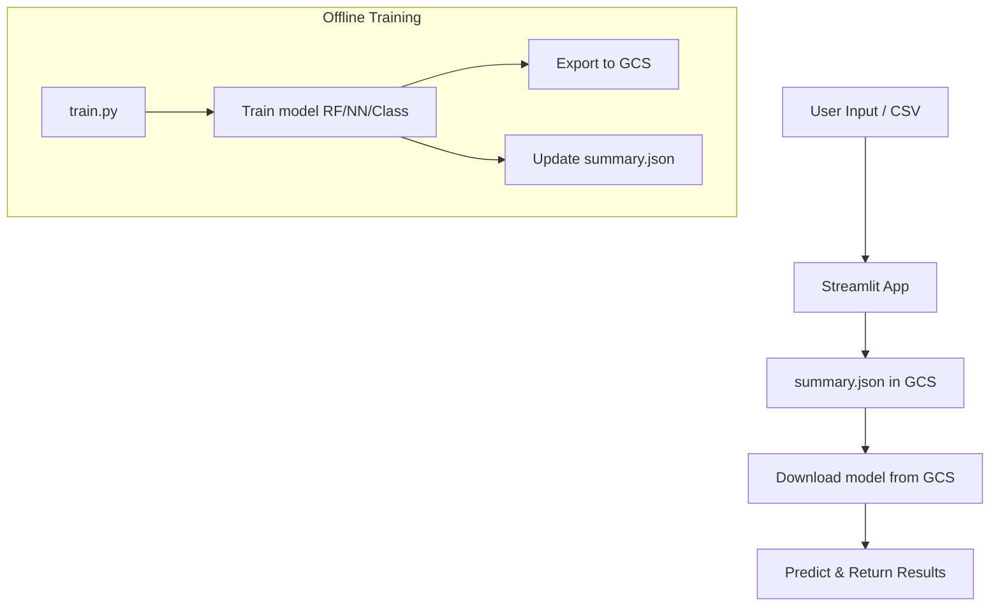

# 🚲 Bike Count Prediction

## (Streamlit + MLflow + GCS + Custom Registry)

[](https://github.com/arthurcornelio88/ds_traffic_cyclist1/actions/workflows/ci.yml)
[](https://codecov.io/gh/arthurcornelio88/ds_traffic_cyclist1)
[](https://github.com/astral-sh/ruff)
[](https://github.com/PyCQA/bandit)
[](https://github.com/python/mypy)

A lightweight, production-ready ML app to predict **hourly bicycle traffic** in Paris using a
**Random Forest**, a **Neural Network**, or a **binary classifier** for affluence detection.

> 👉 Try it live: [Streamlit App](https://dstrafficcyclist1.streamlit.app)

---

## 🎯 Features

* 🧠 Predict with **Random Forest**, **Neural Net**, or **Affluence Classifier**
* 🌍 **Zero backend** deployable via **Streamlit Cloud**
* ☁️ Uses **GCS-hosted model artifacts**
* 🔁 Supports real-time & batch predictions
* 📦 Leverages a custom **`summary.json` registry** (no MLflow needed at inference)

---

## 🛠️ Architecture Overview



---

## ⚡ MLflow-Free Inference

Rather than querying the MLflow registry at runtime, we:

* Maintain a lightweight **`summary.json`** in GCS
* Store only the **best model per type/env/test\_mode**
* Load models in Streamlit directly from GCS

✅ Benefits:

* No dependency on a running MLflow instance
* Fast cold-starts
* Seamless hosting on **Streamlit Cloud**

---

## 🚀 Streamlit Cloud Deployment

### 1. Push your repo

Make sure to include:

* `app/streamlit_app.py`
* `requirements.txt`
* `.streamlit/secrets.toml` (locally only)

### 2. Select entry point

Via [https://share.streamlit.io](https://share.streamlit.io):

```text
app/streamlit_app.py
```

### 3. Configure GCP Secrets (Streamlit Cloud)

Add your **service account JSON** via the Streamlit Cloud UI (as secrets):

```toml
env = "PROD"

[gcp_service_account]
type = "service_account"
project_id = "..."
private_key_id = "..."
private_key = "YOUR_PRIVATE_KEY_HERE"
client_email = "..."
...
```

The app will detect and write this to `/tmp/gcp.json` automatically at runtime.

---

## 🧪 Local Development & Training

### ✅ Local `.streamlit/secrets.toml`

Create a local file at `.streamlit/secrets.toml` with the same structure as above. This makes
`st.secrets["gcp_service_account"]` work identically in both local and cloud environments.

```toml
env = "DEV"

[gcp_service_account]
# your full service account key
```

> ⚠️ If missing, fallback to `./gcp.json` is supported for dev.

---

### ⚙️ Setup

```bash
uv init
uv venv
uv sync
source .venv/bin/activate
```

### 🔁 Train models locally

```bash
# Train fast subset
python src/train.py --env dev --model_test

# Full train + GCS export
python src/train.py --env prod
```

### 🧪 Run local UI

```bash
streamlit run app/streamlit_app.py
```

---

## 🧭 MLflow Tracking (Optional)

For model monitoring & experiment tracking.

### In DEV

```bash
export GOOGLE_APPLICATION_CREDENTIALS=./mlflow-ui-access.json

mlflow server \
  --backend-store-uri file:./mlruns_dev \
  --default-artifact-root file:./mlruns_dev/artifacts \
  --host 127.0.0.1 \
  --port 5000
```

### In PROD

```bash
export GOOGLE_APPLICATION_CREDENTIALS=./mlflow-ui-access.json

mlflow server \
  --backend-store-uri file:./mlruns_prod \
  --default-artifact-root gs://df_traffic_cyclist1/mlruns \
  --serve-artifacts \
  --host 127.0.0.1 \
  --port 5000
```

---

## 🔐 GCP Service Account Structure

This project uses **three separate GCP service accounts**:

| ID                    | Role                    | Used for                     |
| --------------------- | ----------------------- | ---------------------------- |
| `mlflow-trainer`      | `Storage Object Admin`  | Model training + upload      |
| `mlflow-ui-access`    | `Storage Object Viewer` | MLflow UI display (optional) |
| `gcp_service_account` | `Storage Object Viewer` | Inference from Streamlit     |

---

## 🧪 Development & Quality

### Pre-commit Hooks

Ensure code quality before every commit:

```bash
# Install pre-commit hooks
uv run pre-commit install

# Run manually
uv run pre-commit run --all-files
```

**Checks performed:**

* ✅ Ruff (linting & formatting)
* ✅ MyPy (type checking)
* ✅ Bandit (security scan)
* ✅ YAML/JSON validation

### CI/CD Pipeline

Every push triggers automated checks:

1. **Pre-commit** - Code quality & security
2. **Tests** - Unit tests with >80% coverage
3. **Artifacts** - Coverage reports (30 days retention)

See [CI/CD Documentation](docs/ci-cd.md) for details.

### Run Tests

```bash
# Run all tests with coverage
uv run pytest tests/ -v --cov

# Run specific test file
uv run pytest tests/test_classes.py -v
```

---

## 📁 Project Structure

```bash
app/
├── app_config.py              # Force import path
├── streamlit_app.py           # Streamlit UI
├── train.py                   # Training CLI
├── model_registry_summary.py  # Custom GCS registry
├── classes.py                 # Pipeline classes (RF, NN, RFC)
data/
models/
mlruns/                        # Optional MLflow tracking
.streamlit/
└── secrets.toml               # Local secrets
```

---

## 💡 Tips

* GCS is read-only from Streamlit — perfect for stateless inference
* Local `.streamlit/secrets.toml` ensures smooth dev/prod parity
* Supports easily extending new model types via `classes.py`

---

## 👨‍🔬 Authors

Built with ❤️ by:

* [Arthur Cornélio](https://github.com/arthurcornelio88)
* [Ibtihel Nemri](https://github.com/ibtihelnemri)
* [Bruno Happi](https://github.com/brunoCo-de)

---
