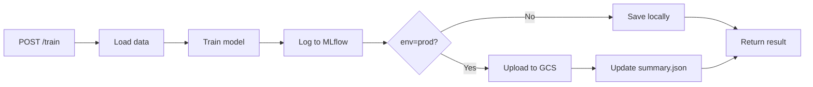
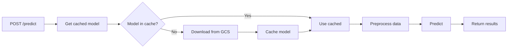

# 🌐 API Endpoints Documentation

Complete reference for RegModel API endpoints in both local development and production environments.

---

## 📍 Base URLs

| Environment | Base URL | Purpose |
|-------------|----------|---------|
| **Local (Docker Compose)** | `http://localhost:8000` | Development & testing |
| **Production (Cloud Run)** | `https://regmodel-api-467498471756.europe-west1.run.app` | Live deployment |

---

## 🔹 POST `/predict`

Run inference with a trained model (Random Forest or Neural Network).

### Request Schema

```json
{
  "records": [
    {
      "nom_du_compteur": "string",
      "date_et_heure_de_comptage": "string (ISO 8601)",
      "coordonnées_géographiques": "string (lat, lon)",
      "mois_annee_comptage": "string"
    }
  ],
  "model_type": "rf | nn",
  "metric": "r2 | rmse"
}
```

### Parameters

| Field | Type | Required | Default | Description |
|-------|------|----------|---------|-------------|
| `records` | array | ✅ | - | List of input records to predict |
| `model_type` | string | ✅ | - | Model type: `"rf"` (Random Forest) or `"nn"` (Neural Network) |
| `metric` | string | ❌ | `"r2"` | Metric to select best model: `"r2"` or `"rmse"` |

### Response Schema

```json
{
  "predictions": [float, ...]
}
```

---

### 🔧 Local Example

```bash
curl -X POST "http://localhost:8000/predict" \
  -H "Content-Type: application/json" \
  -d '{
    "records": [
      {
        "nom_du_compteur": "35 boulevard de Ménilmontant NO-SE",
        "date_et_heure_de_comptage": "2025-05-17 18:00:00+02:00",
        "coordonnées_géographiques": "48.8672, 2.3501",
        "mois_annee_comptage": "mai 2025"
      }
    ],
    "model_type": "nn",
    "metric": "r2"
  }'
```

**Response:**

```json
{
  "predictions": [125.43]
}
```

---

### ☁️ Production Example

```bash
curl -X POST "https://regmodel-api-467498471756.europe-west1.run.app/predict" \
  -H "Content-Type: application/json" \
  -d '{
    "records": [
      {
        "nom_du_compteur": "35 boulevard de Ménilmontant NO-SE",
        "date_et_heure_de_comptage": "2025-05-17 18:00:00+02:00",
        "coordonnées_géographiques": "48.8672, 2.3501",
        "mois_annee_comptage": "mai 2025"
      }
    ],
    "model_type": "rf",
    "metric": "r2"
  }'
```

**Response:**

```json
{
  "predictions": [123.78]
}
```

---

## 🔹 POST `/train`

Train a new model and upload it to GCS. Updates the model registry (`summary.json`).

### Request Schema

```json
{
  "model_type": "rf | nn | rf_class",
  "data_source": "reference | current | custom_path",
  "env": "dev | prod",
  "hyperparams": {},
  "test_mode": false
}
```

### Parameters

| Field | Type | Required | Default | Description |
|-------|------|----------|---------|-------------|
| `model_type` | string | ✅ | - | Model type: `"rf"`, `"nn"`, or `"rf_class"` |
| `data_source` | string | ❌ | `"reference"` | Data source: `"reference"` (DVC), `"current"` (DVC), or custom path |
| `env` | string | ❌ | `"prod"` | Environment: `"dev"` (local save) or `"prod"` (GCS upload) |
| `hyperparams` | object | ❌ | `{}` | Hyperparameters (not yet implemented) |
| `test_mode` | boolean | ❌ | `false` | Use small sample (1000 rows) for fast testing (~30s instead of 2-5min) |

### Response Schema

```json
{
  "status": "success",
  "model_type": "string",
  "run_id": "string",
  "metrics": {
    "r2": "string",
    "rmse": "string"
  },
  "model_uri": "string"
}
```

---

### 🔧 Local Examples

#### Train Random Forest (dev mode)

```bash
curl -X POST "http://localhost:8000/train" \
  -H "Content-Type: application/json" \
  -d '{
    "model_type": "rf",
    "data_source": "reference",
    "env": "dev"
  }'
```

**Response:**

```json
{
  "status": "success",
  "model_type": "rf",
  "run_id": "rf_20251006_143025",
  "metrics": {
    "rmse": 47.28,
    "r2": 0.7920
  },
  "model_uri": "gs://df_traffic_cyclist1/models/rf/"
}
```

#### Train Neural Network

```bash
curl -X POST "http://localhost:8000/train" \
  -H "Content-Type: application/json" \
  -d '{
    "model_type": "nn",
    "data_source": "reference",
    "env": "dev"
  }'
```

#### Train Classifier (affluence detection)

```bash
curl -X POST "http://localhost:8000/train" \
  -H "Content-Type: application/json" \
  -d '{
    "model_type": "rf_class",
    "data_source": "reference",
    "env": "dev"
  }'
```

#### Train with current data (DVC)

```bash
curl -X POST "http://localhost:8000/train" \
  -H "Content-Type: application/json" \
  -d '{
    "model_type": "rf",
    "data_source": "current",
    "env": "dev"
  }'
```

#### ⚡ Fast Test Mode (1000 samples, ~30s)

Perfect for integration testing and development:

```bash
# Random Forest - fast test
curl -X POST "http://localhost:8000/train" \
  -H "Content-Type: application/json" \
  -d '{
    "model_type": "rf",
    "data_source": "reference",
    "env": "dev",
    "test_mode": true
  }'

# Neural Network - fast test (~1 minute)
curl -X POST "http://localhost:8000/train" \
  -H "Content-Type: application/json" \
  -d '{
    "model_type": "nn",
    "data_source": "reference",
    "env": "dev",
    "test_mode": true
  }'
```

**Benefits:**

- ⚡ **6-30 seconds** (NN: ~6s, RF: ~30s) vs 2-5 minutes full training
- 🧪 Perfect for testing API integration
- 🏷️ Tagged in MLflow with `test_mode=True`
- 📊 Uses pre-generated `test_sample.csv` (1000 rows, ~1MB) instead of full dataset (980MB)
- 💾 Avoids loading massive files in memory

**Example response:**

```json
{
  "status": "success",
  "model_type": "nn",
  "run_id": "nn_20251006_200409",
  "metrics": {
    "rmse": 76.17,
    "r2": 0.4676
  },
  "model_uri": "gs://df_traffic_cyclist1/models/nn/"
}
```

---

### ☁️ Production Examples

#### Train and upload to GCS

```bash
curl -X POST "https://regmodel-api-467498471756.europe-west1.run.app/train" \
  -H "Content-Type: application/json" \
  -d '{
    "model_type": "rf",
    "data_source": "reference",
    "env": "prod"
  }'
```

**What happens:**

1. ✅ Loads data from `data/reference_data.csv`
2. ✅ Trains Random Forest model
3. ✅ Logs experiment to MLflow (<http://localhost:5000>)
4. ✅ Uploads model artifacts to `gs://df_traffic_cyclist1/models/rf/`
5. ✅ Updates `gs://df_traffic_cyclist1/models/summary.json`

**Expected duration:** 2-5 minutes depending on model type

---

## 🔹 GET `/health`

Health check endpoint (available soon).

### 🔧 Local Example

```bash
curl http://localhost:8000/health
```

### ☁️ Production Example

```bash
curl https://regmodel-api-467498471756.europe-west1.run.app/health
```

---

## 🔹 GET `/docs`

Interactive API documentation (Swagger UI).

### 🔧 Local

Visit: <http://localhost:8000/docs>

### ☁️ Production

Visit: <https://regmodel-api-467498471756.europe-west1.run.app/docs>

---

## 🔹 GET `/redoc`

Alternative API documentation (ReDoc).

### 🔧 Local

Visit: <http://localhost:8000/redoc>

### ☁️ Production

Visit: <https://regmodel-api-467498471756.europe-west1.run.app/redoc>

---

## 📦 Model Types

| Model Type | Description | Metrics | Training Time |
|------------|-------------|---------|---------------|
| `rf` | Random Forest Regressor | `r2`, `rmse` | ~2 min |
| `nn` | Neural Network Regressor | `r2`, `rmse` | ~3-5 min |
| `rf_class` | Random Forest Classifier (affluence) | `accuracy`, `precision`, `recall`, `f1_score` | ~2 min |

---

## 📊 Data Sources

| Source | Description | Path | DVC |
|--------|-------------|------|-----|
| `reference` | Reference dataset (training) | `data/reference_data.csv` | ✅ |
| `current` | Current dataset (production) | `data/current_data.csv` | ✅ |
| custom path | Custom CSV file | Specify full path | ❌ |

---

## 🔐 Authentication

### Local Development

No authentication required (open access on localhost).

### Production (Cloud Run)

**Current:** Open access (no authentication)

**Future (Phase 4):**

- API Key via `X-API-Key` header
- Rate limiting: 100 requests/minute

---

## 🧪 Testing Workflows

### 1. Test prediction locally

```bash
# Start docker-compose
docker compose up

# Test prediction
curl -X POST "http://localhost:8000/predict" \
  -H "Content-Type: application/json" \
  -d '{
    "records": [{"nom_du_compteur": "Test", "date_et_heure_de_comptage": "2025-05-17 18:00:00+02:00", "coordonnées_géographiques": "48.8672, 2.3501", "mois_annee_comptage": "mai 2025"}],
    "model_type": "rf",
    "metric": "r2"
  }'
```

### 2. Train model locally

```bash
# Train RF in dev mode (saves locally)
curl -X POST "http://localhost:8000/train" \
  -H "Content-Type: application/json" \
  -d '{"model_type": "rf", "data_source": "reference", "env": "dev"}'

# Check MLflow UI
open http://localhost:5000
```

### 3. Full integration test

```bash
# 1. Train model
curl -X POST "http://localhost:8000/train" \
  -H "Content-Type: application/json" \
  -d '{"model_type": "rf", "data_source": "reference", "env": "dev"}'

# 2. Wait for training to complete (~2 min)

# 3. Restart API to load new model
docker compose restart regmodel-backend

# 4. Test prediction
curl -X POST "http://localhost:8000/predict" \
  -H "Content-Type: application/json" \
  -d '{"records": [{"nom_du_compteur": "Test", "date_et_heure_de_comptage": "2025-05-17 18:00:00+02:00", "coordonnées_géographiques": "48.8672, 2.3501", "mois_annee_comptage": "mai 2025"}], "model_type": "rf", "metric": "r2"}'
```

---

## 🐛 Common Errors

### 404 Not Found

**Cause:** Wrong endpoint URL

**Solution:** Check base URL and endpoint path

```bash
# ❌ Wrong
curl http://localhost:8000/api/predict

# ✅ Correct
curl http://localhost:8000/predict
```

### 422 Unprocessable Entity

**Cause:** Invalid request body

**Solution:** Check required fields and data types

```bash
# ❌ Missing required field
{"records": []}

# ✅ Correct
{"records": [...], "model_type": "rf"}
```

### 500 Internal Server Error

**Cause:** Model not found, GCS credentials issue, or training error

**Solution:** Check logs

```bash
# Local
docker compose logs regmodel-backend

# Production
gcloud run logs read regmodel-api --limit 50
```

---

## 📝 Implementation Details

### Training Flow



### Prediction Flow



---

## 🔗 Related Documentation

- [Docker Compose Architecture](docker-compose.md) - Local development setup
- [Backend Deployment](backend.md) - Cloud Run deployment
- [MLOps Roadmap](../MLOPS_ROADMAP.md) - Full implementation plan
- [Train Script](../backend/regmodel/app/train.py) - Training logic
- [FastAPI App](../backend/regmodel/app/fastapi_app.py) - API implementation

---

## 📞 Support

- **Logs (local):** `docker compose logs -f regmodel-backend`
- **Logs (prod):** `gcloud run logs read regmodel-api --limit 50`
- **MLflow UI:** <http://localhost:5000> (local only)
- **API Docs:** <http://localhost:8000/docs> (local) or <https://regmodel-api-467498471756.europe-west1.run.app/docs> (prod)
