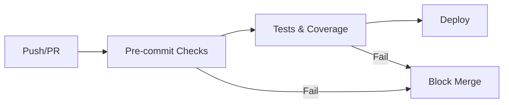

# CI/CD Pipeline Documentation

## Overview

Notre pipeline CI/CD utilise GitHub Actions pour garantir la qualité du code
et l'intégrité du projet à chaque commit.

## Pipeline Structure



## Jobs

### 1. Pre-commit Checks

**Objectif :** Valider la qualité du code avant de lancer les tests.

**Durée :** ~2-3 minutes

**Checks effectués :**

- ✅ **Ruff** - Linting Python (détection d'erreurs, style PEP8)
- ✅ **Ruff Format** - Formatage automatique du code
- ✅ **MyPy** - Vérification des types statiques
- ✅ **Bandit** - Analyse de sécurité (détection de vulnérabilités)
- ✅ **YAML/JSON** - Validation de la syntaxe
- ✅ **Trailing whitespace** - Nettoyage des espaces
- ✅ **End of files** - Vérification des fins de fichiers

**Quand est-il exécuté ?**

- À chaque push sur une branche `feat/*`, `master`, `main`
- À chaque Pull Request vers `master` ou `main`

### 2. Tests & Coverage

**Objectif :** Valider le comportement du code avec des tests unitaires.

**Durée :** ~3-5 minutes

**Tests exécutés :**

- Tests unitaires (`tests/`)
- Coverage des modules critiques :
  - `app.classes`
  - `backend.regmodel.app.model_registry_summary`

**Artefacts générés :**

- Rapport de couverture HTML (disponible 30 jours)
- Rapport XML pour Codecov

## Configuration Locale

### Installation Pre-commit

```bash
# Installer pre-commit hooks localement
uv run pre-commit install

# Exécuter manuellement
uv run pre-commit run --all-files

# Désactiver temporairement (déconseillé)
git commit --no-verify
```

### Configuration Pre-commit

Le fichier `.pre-commit-config.yaml` configure tous les hooks :

```yaml
repos:
  - repo: https://github.com/astral-sh/ruff-pre-commit
    hooks:
      - id: ruff
      - id: ruff-format
  - repo: https://github.com/pre-commit/mirrors-mypy
    hooks:
      - id: mypy
  - repo: https://github.com/PyCQA/bandit
    hooks:
      - id: bandit
```

## Workflow GitHub Actions

### Fichier : `.github/workflows/ci.yml`

```yaml
jobs:
  pre-commit:
    name: Pre-commit Checks
    runs-on: ubuntu-latest
    steps:
      - uses: actions/checkout@v4
      - uses: actions/setup-python@v5
      - run: uv sync
      - run: uv run pre-commit run --all-files

  test:
    name: Run Tests
    needs: pre-commit  # Attend que pre-commit réussisse
    runs-on: ubuntu-latest
    steps:
      - uses: actions/checkout@v4
      - run: uv sync
      - run: uv run pytest tests/ --cov
```

## Bonnes Pratiques

### Avant de Commit

1. **Exécuter pre-commit localement** :

   ```bash
   uv run pre-commit run --all-files
   ```

2. **Vérifier les tests** :

   ```bash
   uv run pytest tests/ -v
   ```

3. **Corriger les erreurs** avant de push

### En Cas d'Échec CI

#### Pre-commit échoue

1. Vérifier les logs dans GitHub Actions
2. Reproduire localement :

   ```bash
   uv run pre-commit run --all-files --show-diff-on-failure
   ```

3. Corriger les erreurs signalées
4. Re-commit et push

#### Tests échouent

1. Consulter le rapport de coverage (artefact GitHub)
2. Reproduire localement :

   ```bash
   uv run pytest tests/ -v --tb=short
   ```

3. Debugger le test qui échoue
4. Re-commit et push

## Dépendances Dev

Les outils de qualité sont définis dans `pyproject.toml` :

```toml
[dependency-groups]
dev = [
    "bandit>=1.8.0",
    "mypy>=1.13.0",
    "pandas-stubs>=2.2.0",
    "pre-commit>=4.0.0",
    "ruff>=0.14.0",
    "types-pytz>=2025.2.0.20250809",
]
```

Installation :

```bash
uv sync  # Installe automatiquement les dépendances dev
```

## Protection des Branches

### Règles Recommandées (GitHub)

1. **Require status checks to pass** :
   - ✅ `Pre-commit Checks`
   - ✅ `Run Tests`

2. **Require branches to be up to date** : Activé

3. **Require conversation resolution** : Activé

4. **Prevent force pushes** : Activé (sauf pour maintainers)

### Configuration GitHub

```text
Settings → Branches → Branch protection rules → master/main
```

## Ignorer Pre-commit (Urgence Uniquement)

Si vraiment nécessaire en urgence production :

```bash
# Ignorer pre-commit (déconseillé !)
git commit --no-verify -m "hotfix: critical bug"

# Ou skip un hook spécifique
SKIP=bandit git commit -m "fix: temporary"
```

⚠️ **Ne jamais ignorer pre-commit sauf urgence production !**

## Debugging

### Pre-commit trop lent ?

Utiliser `--hook-stage manual` pour tester un seul hook :

```bash
uv run pre-commit run ruff --all-files
uv run pre-commit run mypy --all-files
```

### Cache Pre-commit

Pre-commit utilise un cache. Pour le nettoyer :

```bash
uv run pre-commit clean
uv run pre-commit gc
```

### Logs Détaillés

```bash
uv run pre-commit run --all-files --verbose
```

## Monitoring

### GitHub Actions Dashboard

Voir l'état des runs :

```text
https://github.com/arthurcornelio88/ds_traffic_cyclist1/actions
```

### Statistiques

- ⏱️ Temps moyen pre-commit : ~2-3 min
- ⏱️ Temps moyen tests : ~3-5 min
- 📊 Coverage cible : >80%

## Troubleshooting

### Erreur "hook not found"

```bash
uv run pre-commit install
uv run pre-commit autoupdate
```

### Erreur "command not found: ruff"

```bash
uv sync  # Réinstalle les dépendances
```

### MyPy erreurs de types

Ajouter les stubs manquants dans `pyproject.toml` :

```toml
[dependency-groups]
dev = [
    "types-requests",  # Exemple
]
```

## Ressources

- [Pre-commit Documentation](https://pre-commit.com)
- [Ruff Documentation](https://docs.astral.sh/ruff/)
- [MyPy Documentation](https://mypy.readthedocs.io)
- [Bandit Documentation](https://bandit.readthedocs.io)

---

**Dernière mise à jour :** 2025-10-11
