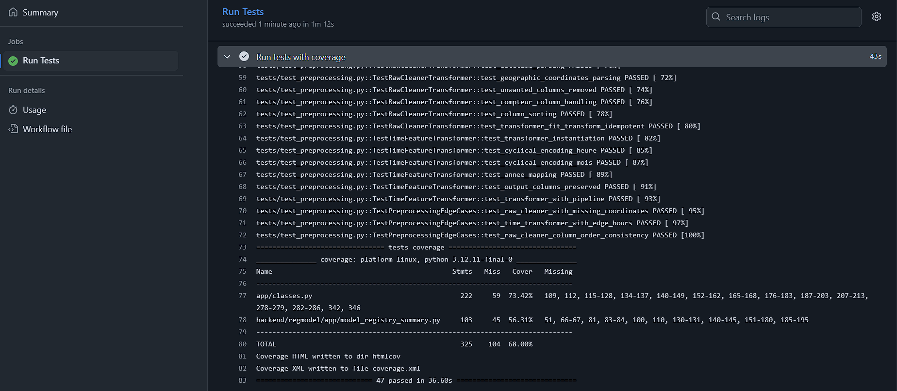
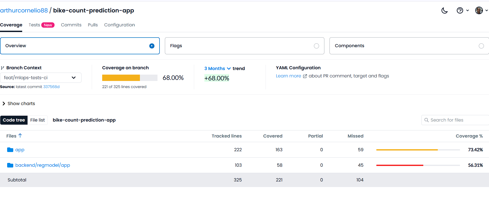

# 🔗 CI/CD Documentation

## Overview

This project uses **GitHub Actions** for Continuous Integration (CI) to automatically run tests, generate coverage reports, and validate code quality on every push and pull request.

---

## GitHub Actions Workflow

**File**: [.github/workflows/ci.yml](../.github/workflows/ci.yml)

### Triggers

The CI workflow runs automatically on:
- ✅ Push to `feat/*` branches
- ✅ Push to `master` or `main` branches
- ✅ Pull requests to `master` or `main`

### Workflow Steps

1. **Checkout code** - Clones the repository
2. **Set up Python 3.12** - Configures Python environment
3. **Install UV** - Fast dependency management tool
4. **Install dependencies** - Runs `uv sync` to install all packages
5. **Run tests** - Executes all 47 tests with `pytest`
6. **Generate coverage** - Creates coverage reports (HTML + XML)
7. **Upload artifacts** - Coverage HTML report available for 30 days
8. **Upload to Codecov** (optional) - Sends coverage to Codecov service

---

## Workflow Configuration

```yaml
name: MLOps CI Tests

on:
  push:
    branches: [feat/*, master, main]
  pull_request:
    branches: [master, main]

jobs:
  test:
    name: Run Tests
    runs-on: ubuntu-latest

    steps:
      - name: Checkout code
        uses: actions/checkout@v4

      - name: Set up Python 3.12
        uses: actions/setup-python@v5
        with:
          python-version: '3.12'

      - name: Install uv
        uses: astral-sh/setup-uv@v4
        with:
          version: "latest"

      - name: Install dependencies
        run: |
          uv sync

      - name: Run tests with pytest
        run: |
          uv run pytest tests/ -v --tb=short

      - name: Run tests with coverage
        run: |
          uv run pytest tests/ \
            --cov=app.classes \
            --cov=backend.regmodel.app.model_registry_summary \
            --cov-report=term-missing \
            --cov-report=xml \
            --cov-report=html

      - name: Upload coverage to Codecov (optional)
        if: github.event_name == 'push'
        uses: codecov/codecov-action@v4
        with:
          file: ./coverage.xml
          fail_ci_if_error: false
        continue-on-error: true

      - name: Upload coverage HTML report
        if: always()
        uses: actions/upload-artifact@v4
        with:
          name: coverage-report
          path: htmlcov/
          retention-days: 30

      - name: Test Summary
        if: always()
        run: |
          echo "## Test Results 🧪" >> $GITHUB_STEP_SUMMARY
          echo "" >> $GITHUB_STEP_SUMMARY
          echo "✅ All tests completed" >> $GITHUB_STEP_SUMMARY
          echo "" >> $GITHUB_STEP_SUMMARY
          echo "### Coverage Report" >> $GITHUB_STEP_SUMMARY
          echo "Coverage reports are available in the artifacts" >> $GITHUB_STEP_SUMMARY
```

---

## Key Features

### 🚀 Fast Dependency Management with UV

- **Why UV?** - 10-100x faster than pip
- **Installation**: `astral-sh/setup-uv@v4` action
- **Command**: `uv sync` (respects `pyproject.toml` and lockfile)

### 📊 Coverage Reports

**Targeted coverage** on:
- `app.classes` (RFPipeline, NNPipeline, Transformers)
- `backend.regmodel.app.model_registry_summary` (Model registry logic)

**Output formats**:
- **Terminal** (`--cov-report=term-missing`) - Shows missing lines in CI logs
- **XML** (`--cov-report=xml`) - For Codecov integration
- **HTML** (`--cov-report=html`) - Downloadable artifact with detailed line-by-line coverage

### 📦 Artifacts

**Coverage HTML Report**:
- **Name**: `coverage-report`
- **Retention**: 30 days
- **Location**: Actions tab → Workflow run → Artifacts section
- **Contents**: Full HTML coverage report (same as `htmlcov/index.html` locally)

### 📈 Test Summary

GitHub Actions displays a test summary in the workflow run UI showing:
- ✅ Test completion status
- 📊 Coverage report availability
- 🔗 Links to artifacts

---

## Viewing CI Results

In our repo, here's an output of a succeeded worker run:


### 1. GitHub Actions Tab

Navigate to: **Repository → Actions → MLOps CI Tests**

**What you'll see**:
- ✅ Green checkmark = All tests passed
- ❌ Red X = Tests failed
- 🟡 Yellow dot = Workflow running

### 2. Pull Request Checks

When you create a PR, CI runs automatically and shows:
- **Status** in the PR checks section
- **Details** link to view full workflow logs
- **Required checks** must pass before merging

### 3. Coverage Artifacts

**Download coverage report**:
1. Go to workflow run (Actions tab)
2. Scroll to "Artifacts" section
3. Download `coverage-report.zip`
4. Extract and open `index.html` in browser

---

## Local Testing Before Push

**Run the same commands locally**:

```bash
# Install dependencies
uv sync

# Run tests (same as CI)
uv run pytest tests/ -v --tb=short

# Run with coverage (same as CI)
uv run pytest tests/ \
  --cov=app.classes \
  --cov=backend.regmodel.app.model_registry_summary \
  --cov-report=term-missing \
  --cov-report=html
```

**View local coverage**:
```bash
open htmlcov/index.html  # macOS
xdg-open htmlcov/index.html  # Linux
start htmlcov/index.html  # Windows
```

---

## Codecov Integration ✅

**Status**: ✅ **Active and configured!**

### 📊 Current Coverage

Our project is integrated with Codecov and shows **68.00% coverage**:



**Live dashboard**: [https://app.codecov.io/gh/arthurcornelio88/bike-count-prediction-app](https://app.codecov.io/gh/arthurcornelio88/bike-count-prediction-app)

### 📈 Coverage Breakdown

| File | Coverage | Status |
|------|----------|--------|
| `app/` | **73.42%** | 🟢 Good (163/222 lines covered) |
| `backend/regmodel/app/` | **56.31%** | 🟡 Acceptable (58/103 lines covered) |
| **Overall** | **68.00%** | 🟢 **Target met** (221/325 lines) |

### 🎯 Key Features

**What Codecov provides**:
- ✅ **Coverage trends** - Track coverage over time (3 months trend: +68.00%)
- ✅ **PR coverage diff** - See how each PR affects coverage
- ✅ **File-level analysis** - Drill down to see which lines are covered/missed
- ✅ **Flags & Components** - Separate coverage for different test suites
- ✅ **YAML configuration** - Custom coverage targets and rules

### 🔧 Setup (Already Done!)

**Steps completed**:
1. ✅ Signed up at [codecov.io](https://codecov.io)
2. ✅ Connected GitHub repository
3. ✅ Configured `.github/workflows/ci.yml` to upload coverage
4. ✅ Coverage reports uploaded automatically on every push

**Workflow integration** (lines 44-50 in `ci.yml`):
```yaml
- name: Upload coverage to Codecov (optional)
  if: github.event_name == 'push'
  uses: codecov/codecov-action@v4
  with:
    file: ./coverage.xml
    fail_ci_if_error: false
  continue-on-error: true
```

### 🏆 Optional Enhancements

**Add coverage badge to README**:
```markdown
[](https://codecov.io/gh/arthurcornelio88/bike-count-prediction-app)
```

**Configure coverage targets** (create `codecov.yml`):
```yaml
coverage:
  status:
    project:
      default:
        target: 70%
        threshold: 2%
    patch:
      default:
        target: 60%
```

### 📊 Viewing Coverage

**Access methods**:
1. **Direct link**: [codecov.io/gh/arthurcornelio88/bike-count-prediction-app](https://app.codecov.io/gh/arthurcornelio88/bike-count-prediction-app)
2. **From GitHub PR**: Click "Details" next to "codecov/project" check
3. **From commit**: Click commit → Checks → Codecov

**What you can see**:
- 📁 **File tree** with color-coded coverage
- 📈 **Trend charts** (3 months history)
- 🔍 **Line-by-line** coverage (click on files)
- 📊 **Components** breakdown (app vs backend)

---

## Troubleshooting

### Tests fail in CI but pass locally

**Common causes**:
- **Missing dependencies** - Run `uv sync` locally to match CI environment
- **Environment variables** - CI doesn't have local `.env` files
- **File paths** - Use absolute imports, not relative paths

**Solution**:
```bash
# Reproduce CI environment locally
uv sync
uv run pytest tests/ -v
```

### Coverage report not generated

**Check**:
- Workflow logs for errors in "Run tests with coverage" step
- Ensure `pytest-cov` is in dependencies (`uv add pytest-cov --dev`)

### UV installation fails

**Fallback to pip**:
```yaml
- name: Install dependencies
  run: |
    pip install -U pip
    pip install -e ".[dev]"
```

---

## Current Status

| Metric | Value |
|--------|-------|
| **Workflow** | ✅ Active |
| **Tests** | 47 |
| **Coverage** | 68.00% |
| **Python** | 3.12 |
| **Package Manager** | UV |

---

## Next Steps

- [ ] Add branch protection rules (require CI to pass before merge)
- [ ] Set up Codecov integration
- [ ] Add code quality checks (linting, type checking)
- [ ] Add deployment workflow (CD) for Cloud Run

---

## Related Documentation

- [Pytest Documentation](pytest.md) - Full test suite documentation
- [GitHub Actions Docs](https://docs.github.com/en/actions)
- [UV Documentation](https://docs.astral.sh/uv/)
- [Codecov Documentation](https://docs.codecov.com/)
