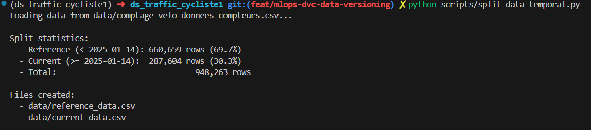
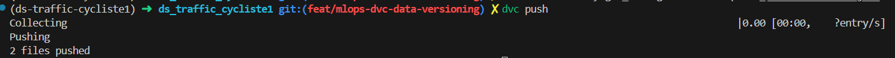

# 📦 DVC Data Versioning Documentation

## Overview

This project uses **DVC (Data Version Control)** to version datasets with GCS (Google Cloud Storage) as remote storage.

### Why DVC?

- ✅ Version large datasets without bloating Git repo
- ✅ Track data lineage and reproducibility
- ✅ Share datasets across team via GCS
- ✅ Enable temporal split for drift detection

---

## 📊 Dataset Split Strategy

### Temporal Split (70/30)

**Dataset range**: 2024-04-01 to 2025-05-17 (13 months)
**Cutoff date**: 2025-01-14

| Dataset | Period | Rows | Usage |
|---------|--------|------|-------|
| **reference_data.csv** | < 2025-01-14 | 660,659 (69.7%) | Training & testing models |
| **current_data.csv** | ≥ 2025-01-14 | 287,604 (30.3%) | Drift detection & validation |

**Rationale**:
- **Reference data** (7 months): Used for model training with train/test split
- **Current data** (3 months): Simulates production data for drift monitoring

---

## 🚀 Setup DVC (First Time)

### 1. Install DVC with GCS support

```bash
# Using uv (recommended)
uv add dvc-gs

# Or using pip
pip install "dvc[gs]"
```

### 2. Initialize DVC

```bash
dvc init
```

### 3. Configure GCS remote

```bash
# Add remote storage
dvc remote add -d gcs_storage gs://df_traffic_cyclist1/dvc-storage

# Configure credentials (use mlflow-trainer for write access)
dvc remote modify gcs_storage credentialpath ./mlflow-trainer.json
```

### 4. Verify configuration

```bash
cat .dvc/config
```

Expected output:
```ini
[core]
    remote = gcs_storage
['remote "gcs_storage"']
    url = gs://df_traffic_cyclist1/dvc-storage
    credentialpath = ./mlflow-trainer.json
```

---

## 📁 Data Versioning Workflow

### Create temporal split

```bash
python scripts/split_data_temporal.py
```

Output:



### Track datasets with DVC

```bash
# Track reference dataset
dvc add data/reference_data.csv

# Track current dataset
dvc add data/current_data.csv
```

This creates `.dvc` metadata files (versioned in Git):
- `data/reference_data.csv.dvc`
- `data/current_data.csv.dvc`

### Push data to GCS

```bash
# Set credentials (if not already in config)
export GOOGLE_APPLICATION_CREDENTIALS=./mlflow-trainer.json

# Push to remote storage
dvc push
```

Output:



### Commit DVC metadata to Git

```bash
# Stage DVC files
git add data/*.dvc .dvc/config .gitignore

# Commit
git commit -m "feat: add DVC data versioning with temporal split"
```

---

## 🔄 Pull Data (Team Collaboration)

When a team member clones the repo, they can pull datasets:

```bash
# Pull all tracked data
dvc pull

# Pull specific dataset
dvc pull data/reference_data.csv.dvc
```

---

## 🔧 Common Commands

### Check DVC status
```bash
dvc status
```

### List tracked files
```bash
dvc list . data/
```

### Show file info
```bash
dvc get . data/reference_data.csv.dvc
```

### Update remote credentials
```bash
dvc remote modify gcs_storage credentialpath ./mlflow-trainer.json
```

---

## 📂 File Structure

```
.
├── .dvc/
│   ├── .gitignore          # DVC internal files
│   └── config              # Remote storage config
├── data/
│   ├── reference_data.csv.dvc    # DVC metadata (versioned in Git)
│   ├── current_data.csv.dvc      # DVC metadata (versioned in Git)
│   ├── reference_data.csv        # Actual data (git-ignored, stored in GCS)
│   └── current_data.csv          # Actual data (git-ignored, stored in GCS)
├── scripts/
│   └── split_data_temporal.py    # Temporal split script
└── .dvcignore                     # DVC ignore patterns
```

---

## 🔗 Integration with MLOps Pipeline

### Airflow DAG usage

```python
from airflow.operators.python import PythonOperator

def pull_reference_data(**context):
    import subprocess
    # Pull reference data for training
    subprocess.run(['dvc', 'pull', 'data/reference_data.csv.dvc'])

def pull_current_data(**context):
    import subprocess
    # Pull current data for drift detection
    subprocess.run(['dvc', 'pull', 'data/current_data.csv.dvc'])

# Tasks
fetch_train_data = PythonOperator(
    task_id='fetch_train_data',
    python_callable=pull_reference_data
)

fetch_prod_data = PythonOperator(
    task_id='fetch_prod_data',
    python_callable=pull_current_data
)
```

### Training script usage

```python
# src/train.py
import subprocess

# Pull reference data
subprocess.run(['dvc', 'pull', 'data/reference_data.csv.dvc'])

# Load and train
df = pd.read_csv('data/reference_data.csv')
X, y = prepare_features(df)
model.fit(X, y)
```

### Drift detection usage

```python
# monitoring/drift_detector.py
import subprocess

# Pull both datasets
subprocess.run(['dvc', 'pull', 'data/reference_data.csv.dvc'])
subprocess.run(['dvc', 'pull', 'data/current_data.csv.dvc'])

# Detect drift
reference = pd.read_csv('data/reference_data.csv')
current = pd.read_csv('data/current_data.csv')
detect_drift(reference, current)
```

---

## 📚 Resources

- [DVC Documentation](https://dvc.org/doc)
- [DVC with GCS Guide](https://dvc.org/doc/user-guide/data-management/remote-storage/google-cloud-storage)
- [DVC Best Practices](https://dvc.org/doc/user-guide/best-practices)

---

## ✅ Checklist

- [x] DVC initialized
- [x] GCS remote configured (`gs://df_traffic_cyclist1/dvc-storage`)
- [x] Credentials set (`mlflow-trainer.json`)
- [x] Temporal split created (70/30)
- [x] Datasets tracked (`reference_data.csv.dvc`, `current_data.csv.dvc`)
- [x] Data pushed to GCS
- [x] `.dvc` files committed to Git
- [x] `.gitignore` allows `.dvc` metadata
