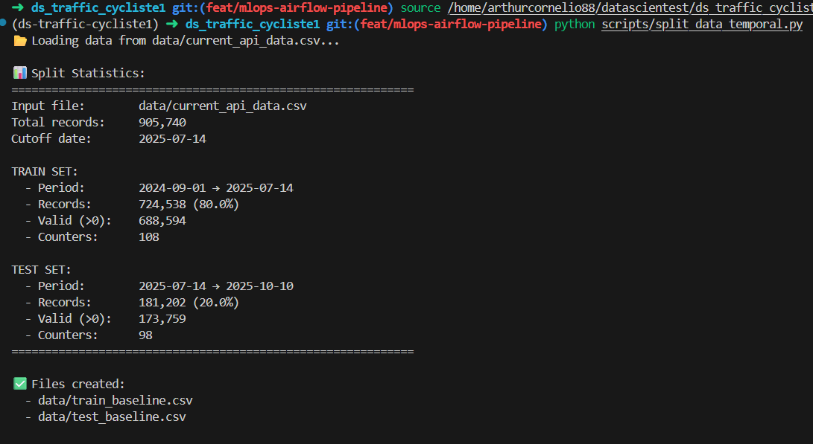
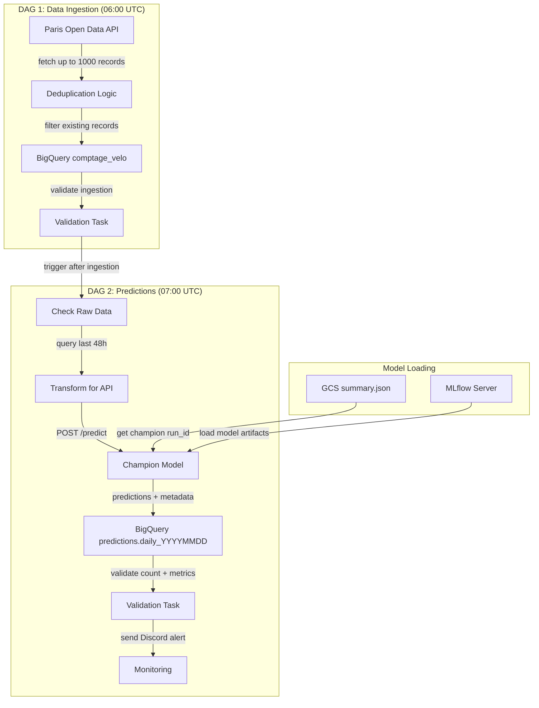

# 📊 Data Ingestion Strategy - Final Decision

**Date**: 2025-10-11
**Version**: 2.0
**Status**: ✅ Validated by data quality analysis

---

## 🎯 Executive Summary

After thorough data quality validation, we identified that all our data sources
(reference_data.csv, current_data.csv, and current_api_data.csv) originate from
**Paris Open Data historical exports**, ensuring perfect consistency.

**Final Decision**: Use `current_api_data.csv` (905k records, 2024-09-01 → 2025-10-10)
as the unified baseline, complemented by daily live API ingestion starting 2025-10-11.

---

## ✅ Recommended Architecture

```text
PRODUCTION MLOps PIPELINE:
═══════════════════════════════════════════════════════════════════

📦 BASELINE (One-time setup)
└── current_api_data.csv (905,740 records, 2024-09-01 → 2025-10-10)
    │
    ├── 80% TRAIN → ~724k records (2024-09 → 2025-08)
    │   └── Train legacy model (champion)
    │
    └── 20% TEST → ~181k records (2025-08 → 2025-10)
        └── Fixed holdout for all model evaluations

🔄 DAILY OPERATIONS (Starting 2025-10-11)
├── DAG fetch: API → BigQuery.daily_YYYYMMDD (100 records/day)
├── DAG predict: Champion model → Predictions
└── Store predictions for monitoring

📊 WEEKLY MONITORING
├── Aggregate last 7 days from BigQuery.daily_*
├── Drift detection: Compare vs TEST set
├── IF drift detected:
│   ├── Fine-tune champion on last 30 days
│   ├── Evaluate on SAME test set
│   └── Champion/Challenger decision
└── ELSE: Keep champion

📈 MONTHLY FULL RETRAIN (Optional)
└── Retrain from scratch with updated train/test split
```

---

## 🔑 Key Advantages

| Aspect | Benefit |
|--------|---------|
| **Temporal Continuity** | Zero gap between test set (2025-10-10) and live API (2025-10-11) |
| **Fresh Baseline** | Test set represents current traffic patterns (vs 5-month gap with old split) |
| **Data Quality** | Perfect correlation (r=1.0) between all sources - same origin |
| **Seasonality** | Full year cycle coverage (Sep → Oct) |
| **Drift Detection** | Accurate baseline for monitoring production data |
| **Single Source** | One consistent dataset from Paris Open Data |

---

## 📋 Implementation Checklist

### Phase 1: Data Preparation ✅

```bash
# 1. Create train/test split from current_api_data.csv (80/20)
python scripts/split_data_temporal.py

# Expected output:
# - train_baseline.csv: ~724k records (2024-09-01 → 2025-08-15)
# - test_baseline.csv: ~181k records (2025-08-16 → 2025-10-10)
```



### Phase 2: Version Control & Upload

```bash
# Upload to GCS raw_data/
gsutil -m cp data/train_baseline.csv gs://<your-bucket>/raw_data/train_baseline.csv
gsutil -m cp data/test_baseline.csv gs://<your-bucket>/raw_data/test_baseline.csv

# Track with DVC
dvc add data/train_baseline.csv data/test_baseline.csv
dvc push

# Commit DVC metadata
git add data/train_baseline.csv.dvc data/test_baseline.csv.dvc
git commit -m "chore: add new baseline splits from current_api_data"
```

### Phase 3: Train Champion Model (Local)

```bash
# Train champion model locally on train_baseline.csv
python scripts/train_legacy_model.py \
    --train data/train_baseline.csv \
    --test data/test_baseline.csv \
    --output models/champion_v1

# Expected metrics to beat:
# - MAE: < 15
# - RMSE: < 25
# - R²: > 0.85

# Upload champion to MLflow/GCS for production use
```

**Note**: Champion model is trained locally once. Production will only perform fine-tuning on fresh data.

### Phase 4: BigQuery Setup

```bash
# Only daily API fetch will populate BigQuery (no historical baseline upload)
# BigQuery tables: bike_traffic_raw.daily_YYYYMMDD

# Schema auto-created by DAG fetch
# Data accumulates daily starting 2025-10-11
```

### Phase 5: Configure DAG Fetch

> To implement

### Phase 6: Weekly Monitoring DAG

> To implement

---

## 📊 Data Quality Validation Results

**Script**: [scripts/validate_overlap_data_quality.py](../scripts/validate_overlap_data_quality.py)
**Report**: [docs/overlap_data_quality_validation.json](overlap_data_quality_validation.json)

### Overlap Period Comparison (2024-09-01 → 2025-05-17)

We compared historical CSV (reference + current) vs current_api_data.csv:

| Metric | Value | Interpretation |
|--------|-------|----------------|
| **Pearson correlation** | r = 1.0000 | **Perfect correlation** |
| **MAE** | 0.00 | Zero error - identical values |
| **MAPE** | 0.00% | No difference |
| **Match rate** | 100.0% | All records match |
| **KS test p-value** | 1.0000 | Identical distributions |
| **Matched records** | 563,765 / 563,815 | 99.99% overlap |

### Conclusion

All data sources are from **Paris Open Data historical exports**, downloaded at different
times but from the same origin. This ensures:

- ✅ Perfect data consistency
- ✅ No data quality issues
- ✅ Trustworthy for training and evaluation

---

## 🔄 DataOps Workflow

### Daily Operations

**Complete Daily Pipeline** (DAG 1 → DAG 2):



**Key Flow Details:**

1. **DAG 1 (06:00)**: Fetches fresh data, deduplicates against existing records, stores in partitioned table
2. **DAG 2 (07:00)**: Runs 1h after ingestion, queries last 48h window, generates predictions with current champion
3. **Champion Tracking**: Every prediction tagged with `model_version` (MLflow run_id) for full traceability

---

## 📚 Appendix: Previous Analysis Context

<details>
<summary>Click to expand: Initial temporal continuity audit</summary>

### Initial Audit Results

We initially explored using reference_data.csv + current_data.csv (948k records,
2024-04 → 2025-05) with live API ingestion starting 2025-05-18.

#### Discovered Issues

1. **5-month gap** between test set (May 2025) and current date (October 2025)
2. **Outdated baseline** for drift detection
3. **Seasonality mismatch** (test set from spring, production in fall)

#### Solution

Use current_api_data.csv instead, which extends to 2025-10-10, eliminating the gap.

### Temporal Coverage

| Dataset | Period | Records | Status |
|---------|--------|---------|--------|
| reference_data.csv | 2024-04 → 2025-01 | 660k | ⚠️ Superseded |
| current_data.csv | 2025-01 → 2025-05 | 287k | ⚠️ Superseded |
| **current_api_data.csv** | 2024-09 → 2025-10 | 905k | ✅ **New baseline** |

</details>

<details>
<summary>Click to expand: BigQuery architecture details</summary>

### BigQuery Structure

```text
PROJECT: datascientest-460618
└── DATASET: bike_traffic_raw
    ├── historical_baseline          ← One-time load (train_baseline.csv)
    │   └── 724k records (2024-09-01 → 2025-08-15)
    │
    ├── daily_20251011               ← Daily API ingestion
    ├── daily_20251012
    ├── daily_...
    │   └── ~100 records/day
    │
    └── all_data (VIEW)              ← Union view
        └── SELECT * FROM historical_baseline
            UNION ALL
            SELECT * FROM `daily_*`
```

### Unified Schema

| Column | Type | Source |
|--------|------|--------|
| `comptage_horaire` | INTEGER | Bike count/hour |
| `date_et_heure_de_comptage` | TIMESTAMP | Count timestamp |
| `identifiant_du_compteur` | STRING | Counter ID |
| `nom_du_compteur` | STRING | Counter name |
| `coordonnees_geographiques` | STRING | "lat, lon" format |
| `ingestion_ts` | TIMESTAMP | Ingestion time |

</details>

---

**Date**: 2025-11-06
**Version**: 2.0
**Status**: ✅ Strategy finalized based on data quality analysis
