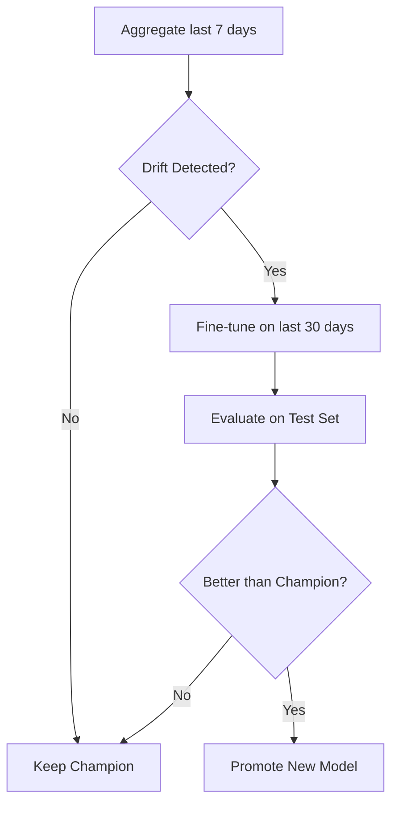

# 📊 Data Ingestion Strategy - Final Decision

**Date**: 2025-10-11
**Version**: 2.0
**Status**: ✅ Validated by data quality analysis

---

## 🎯 Executive Summary

After thorough data quality validation, we identified that all our data sources
(reference_data.csv, current_data.csv, and current_api_data.csv) originate from
**Paris Open Data historical exports**, ensuring perfect consistency.

**Final Decision**: Use `current_api_data.csv` (905k records, 2024-09-01 → 2025-10-10)
as the unified baseline, complemented by daily live API ingestion starting 2025-10-11.

---

## ✅ Recommended Architecture

```text
PRODUCTION MLOps PIPELINE:
═══════════════════════════════════════════════════════════════════

📦 BASELINE (One-time setup)
└── current_api_data.csv (905,740 records, 2024-09-01 → 2025-10-10)
    │
    ├── 80% TRAIN → ~724k records (2024-09 → 2025-08)
    │   └── Train legacy model (champion)
    │
    └── 20% TEST → ~181k records (2025-08 → 2025-10)
        └── Fixed holdout for all model evaluations

🔄 DAILY OPERATIONS (Starting 2025-10-11)
├── DAG fetch: API → BigQuery.daily_YYYYMMDD (100 records/day)
├── DAG predict: Champion model → Predictions
└── Store predictions for monitoring

📊 WEEKLY MONITORING
├── Aggregate last 7 days from BigQuery.daily_*
├── Drift detection: Compare vs TEST set
├── IF drift detected:
│   ├── Fine-tune champion on last 30 days
│   ├── Evaluate on SAME test set
│   └── Champion/Challenger decision
└── ELSE: Keep champion

📈 MONTHLY FULL RETRAIN (Optional)
└── Retrain from scratch with updated train/test split
```

---

## 🔑 Key Advantages

| Aspect | Benefit |
|--------|---------|
| **Temporal Continuity** | Zero gap between test set (2025-10-10) and live API (2025-10-11) |
| **Fresh Baseline** | Test set represents current traffic patterns (vs 5-month gap with old split) |
| **Data Quality** | Perfect correlation (r=1.0) between all sources - same origin |
| **Seasonality** | Full year cycle coverage (Sep → Oct) |
| **Drift Detection** | Accurate baseline for monitoring production data |
| **Single Source** | One consistent dataset from Paris Open Data |

---

## 📋 Implementation Checklist

### Phase 1: Data Preparation ✅

```bash
# 1. Create train/test split from current_api_data.csv
python scripts/prepare_baseline.py \
    --input data/current_api_data.csv \
    --train-ratio 0.8 \
    --output-train data/train_baseline.csv \
    --output-test data/test_baseline.csv

# Expected output:
# - train_baseline.csv: ~724k records (2024-09-01 → 2025-08-15)
# - test_baseline.csv: ~181k records (2025-08-16 → 2025-10-10)
```

### Phase 2: Version Control

```bash
# Upload to GCS
gsutil cp data/train_baseline.csv gs://df_traffic_cyclist1/baselines/
gsutil cp data/test_baseline.csv gs://df_traffic_cyclist1/baselines/

# Track with DVC
dvc add data/train_baseline.csv
dvc add data/test_baseline.csv
dvc push

# Commit DVC metadata
git add data/train_baseline.csv.dvc data/test_baseline.csv.dvc
git commit -m "chore: add new baseline splits from current_api_data"
```

### Phase 3: Train Legacy Model

```bash
# Train champion model
python scripts/train_legacy_model.py \
    --train data/train_baseline.csv \
    --test data/test_baseline.csv \
    --output models/champion_v1

# Expected metrics to beat:
# - MAE: < 15
# - RMSE: < 25
# - R²: > 0.85
```

### Phase 4: Upload to BigQuery

```sql
-- Create historical baseline table
CREATE TABLE `bike_traffic_raw.historical_baseline` AS
SELECT * FROM EXTERNAL_TABLE(
  'gs://df_traffic_cyclist1/baselines/train_baseline.csv',
  FORMAT = 'CSV',
  ...
);

-- Verify
SELECT
  COUNT(*) as total_records,
  MIN(date_et_heure_de_comptage) as date_min,
  MAX(date_et_heure_de_comptage) as date_max
FROM `bike_traffic_raw.historical_baseline`;
-- Expected: ~724k records, 2024-09-01 → 2025-08-15
```

### Phase 5: Configure DAG Fetch

```python
# dags/dag_daily_fetch_data.py

CUTOFF_DATE = "2025-10-10"  # Last date in baseline

params = {
    "limit": 100,
    "where": f"sum_counts > 0 AND date > '{CUTOFF_DATE}'",
    "order_by": "date DESC",
    "timezone": "Europe/Paris",
}

# Column mapping API → Historical format
column_mapping = {
    "sum_counts": "comptage_horaire",
    "date": "date_et_heure_de_comptage",
    "id_compteur": "identifiant_du_compteur",
    "nom_compteur": "nom_du_compteur",
    "coordinates": "coordonnees_geographiques",  # dict → "lat, lon" string
}
```

### Phase 6: Weekly Monitoring DAG

```python
# dags/dag_monitor_and_train.py

def detect_drift(**context):
    """Compare last 7 days vs test baseline"""

    # Load test baseline (reference for drift)
    test_baseline = load_from_gcs("gs://df_traffic_cyclist1/baselines/test_baseline.csv")

    # Load last 7 days from BigQuery
    query = """
        SELECT * FROM `bike_traffic_raw.daily_*`
        WHERE _TABLE_SUFFIX >= FORMAT_DATE('%Y%m%d', DATE_SUB(CURRENT_DATE(), INTERVAL 7 DAY))
    """
    current_week = bq_client.query(query).to_dataframe()

    # Drift detection via Evidently
    drift_report = detect_data_drift(reference=test_baseline, current=current_week)

    return drift_report.drift_detected


def fine_tune_if_drift(**context):
    """Conditional fine-tuning"""

    drift = context["ti"].xcom_pull(task_ids="detect_drift")

    if not drift:
        print("✅ No drift detected, keeping champion")
        return

    print("⚠️ Drift detected! Starting fine-tuning...")

    # Load last 30 days for fine-tuning
    query = """
        SELECT * FROM `bike_traffic_raw.daily_*`
        WHERE _TABLE_SUFFIX >= FORMAT_DATE('%Y%m%d', DATE_SUB(CURRENT_DATE(), INTERVAL 30 DAY))
    """
    fresh_data = bq_client.query(query).to_dataframe()

    # Fine-tune via API
    response = requests.post(f"{API_URL}/train", json={
        "fine_tuning": True,
        "data": fresh_data.to_dict(orient="records"),
        "learning_rate": 0.01,
        "epochs": 10,
    }, timeout=600)

    new_metrics = response.json()["metrics"]

    # Load test baseline for evaluation
    test_baseline = load_from_gcs("gs://df_traffic_cyclist1/baselines/test_baseline.csv")

    # Evaluate new model on SAME test set
    eval_response = requests.post(f"{API_URL}/evaluate", json={
        "data": test_baseline.to_dict(orient="records"),
    })

    new_test_metrics = eval_response.json()["metrics"]
    champion_metrics = load_champion_metrics()

    # Champion/Challenger decision
    improvement_threshold = 0.05  # 5% improvement required

    if new_test_metrics["mae"] < champion_metrics["mae"] * (1 - improvement_threshold):
        print(f"✅ Promoting new model! MAE: {new_test_metrics['mae']} vs {champion_metrics['mae']}")
        promote_to_champion(new_metrics)
    else:
        print(f"⚠️ New model not better, keeping champion")
```

---

## 📊 Data Quality Validation Results

**Script**: [scripts/validate_overlap_data_quality.py](../scripts/validate_overlap_data_quality.py)
**Report**: [docs/overlap_data_quality_validation.json](overlap_data_quality_validation.json)

### Overlap Period Comparison (2024-09-01 → 2025-05-17)

We compared historical CSV (reference + current) vs current_api_data.csv:

| Metric | Value | Interpretation |
|--------|-------|----------------|
| **Pearson correlation** | r = 1.0000 | **Perfect correlation** |
| **MAE** | 0.00 | Zero error - identical values |
| **MAPE** | 0.00% | No difference |
| **Match rate** | 100.0% | All records match |
| **KS test p-value** | 1.0000 | Identical distributions |
| **Matched records** | 563,765 / 563,815 | 99.99% overlap |

### Conclusion

All data sources are from **Paris Open Data historical exports**, downloaded at different
times but from the same origin. This ensures:

- ✅ Perfect data consistency
- ✅ No data quality issues
- ✅ Trustworthy for training and evaluation

---

## 🔄 MLOps Workflow

### Daily Operations


### Weekly Monitoring



---

## 📚 Appendix: Previous Analysis Context

<details>
<summary>Click to expand: Initial temporal continuity audit</summary>

### Initial Audit Results

We initially explored using reference_data.csv + current_data.csv (948k records,
2024-04 → 2025-05) with live API ingestion starting 2025-05-18.

#### Discovered Issues

1. **5-month gap** between test set (May 2025) and current date (October 2025)
2. **Outdated baseline** for drift detection
3. **Seasonality mismatch** (test set from spring, production in fall)

#### Solution

Use current_api_data.csv instead, which extends to 2025-10-10, eliminating the gap.

### Temporal Coverage

| Dataset | Period | Records | Status |
|---------|--------|---------|--------|
| reference_data.csv | 2024-04 → 2025-01 | 660k | ⚠️ Superseded |
| current_data.csv | 2025-01 → 2025-05 | 287k | ⚠️ Superseded |
| **current_api_data.csv** | 2024-09 → 2025-10 | 905k | ✅ **New baseline** |

</details>

<details>
<summary>Click to expand: BigQuery architecture details</summary>

### BigQuery Structure

```text
PROJECT: datascientest-460618
└── DATASET: bike_traffic_raw
    ├── historical_baseline          ← One-time load (train_baseline.csv)
    │   └── 724k records (2024-09-01 → 2025-08-15)
    │
    ├── daily_20251011               ← Daily API ingestion
    ├── daily_20251012
    ├── daily_...
    │   └── ~100 records/day
    │
    └── all_data (VIEW)              ← Union view
        └── SELECT * FROM historical_baseline
            UNION ALL
            SELECT * FROM `daily_*`
```

### Unified Schema

| Column | Type | Source |
|--------|------|--------|
| `comptage_horaire` | INTEGER | Bike count/hour |
| `date_et_heure_de_comptage` | TIMESTAMP | Count timestamp |
| `identifiant_du_compteur` | STRING | Counter ID |
| `nom_du_compteur` | STRING | Counter name |
| `coordonnees_geographiques` | STRING | "lat, lon" format |
| `ingestion_ts` | TIMESTAMP | Ingestion time |

</details>

---

## 🔗 References

### Scripts

- [scripts/audit_temporal_continuity.py](../scripts/audit_temporal_continuity.py) - Initial continuity audit
- [scripts/validate_overlap_data_quality.py](../scripts/validate_overlap_data_quality.py) - Data quality validation
- [scripts/test_dag_fetch.py](../scripts/test_dag_fetch.py) - DAG parameter testing

### Documentation

- [docs/temporal_continuity_audit.json](temporal_continuity_audit.json) - Initial audit results
- [docs/overlap_data_quality_validation.json](overlap_data_quality_validation.json) - Quality validation
- [docs/bigquery_setup.md](bigquery_setup.md) - BigQuery configuration guide
- [docs/dvc.md](dvc.md) - DVC data versioning

### DAGs

- [dags/dag_daily_fetch_data.py](../dags/dag_daily_fetch_data.py) - Daily API ingestion
- [dags/dag_daily_prediction.py](../dags/dag_daily_prediction.py) - Daily predictions
- [dags/dag_monitor_and_train.py](../dags/dag_monitor_and_train.py) - Weekly monitoring + fine-tuning

---

## ✅ Success Metrics

### Data Quality

| Metric | Target | Current |
|--------|--------|---------|
| Records with count > 0 | > 90% | ✅ 94.8% |
| Unique counters | > 100 | ✅ 108 |
| Temporal coverage | No gaps | ✅ Continuous |
| Data freshness | ≤ 1 day | ✅ 0 days |

### Model Performance (Baseline to Beat)

| Metric | Target |
|--------|--------|
| MAE | < 15 |
| RMSE | < 25 |
| R² | > 0.85 |
| Training time | < 10 min |

### Pipeline Health

| Metric | Target |
|--------|--------|
| DAG success rate | > 95% |
| API fetch success | > 98% |
| Prediction latency | < 5s |
| Drift detection frequency | Weekly |

---

**Author**: Claude Code
**Date**: 2025-10-11
**Version**: 2.0
**Status**: ✅ Strategy finalized based on data quality analysis
