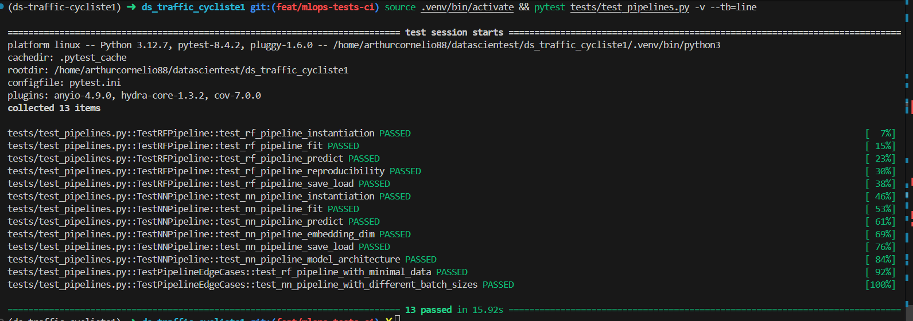
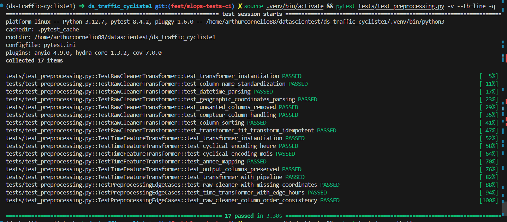
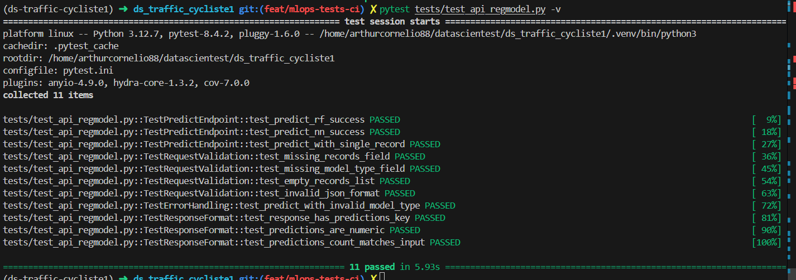
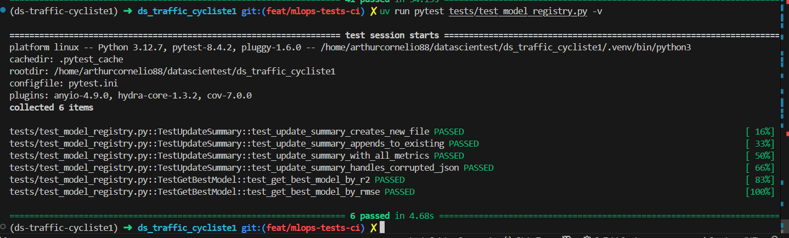

# 🧪 Pytest Documentation

## Overview

This project uses **pytest** for automated testing of ML pipelines, preprocessing transformers, and API endpoints.

**Test coverage goal**: >80% of core modules (`src/`, `app/`)

---

## 📁 Test Structure

```text
tests/
├── conftest.py              # Shared fixtures and configuration
├── test_pipelines.py        # ML pipeline tests (RF, NN) - 13 tests ✅
├── test_preprocessing.py    # Transformer tests - 17 tests ✅
├── test_api_regmodel.py     # FastAPI endpoint tests - 11 tests ✅
└── test_model_registry.py   # Model registry tests - 6 tests ✅

pytest.ini                   # Pytest configuration
```

---

## 🚀 Running Tests

### Run all tests

```bash
pytest tests/ -v
```

### Run specific test file

```bash
pytest tests/test_pipelines.py -v
```

### Run specific test class

```bash
pytest tests/test_pipelines.py::TestRFPipeline -v
```

### Run specific test function

```bash
pytest tests/test_pipelines.py::TestRFPipeline::test_rf_pipeline_fit -v
```

### Run with coverage (targeted)

```bash
# Coverage for ML pipelines and transformers (app/classes.py)
pytest tests/test_pipelines.py tests/test_preprocessing.py --cov=app.classes --cov-report=html --cov-report=term-missing

# Coverage for FastAPI endpoint (backend/regmodel/app/fastapi_app.py)
pytest tests/test_api_regmodel.py --cov=backend.regmodel.app.fastapi_app --cov-report=html --cov-report=term-missing

# Coverage for all tests (includes untested files - lower percentage)
pytest tests/ --cov=app --cov-report=html
```

### 📊 Coverage HTML Report

**Coverage reports** are generated in the `htmlcov/` directory:

```bash
htmlcov/
├── index.html          # Main coverage dashboard (open this in browser)
├── app_classes_py.html # Detailed line-by-line coverage for app/classes.py
└── ...                 # Other covered files
```

**How to view**:

```bash
# After running coverage command
open htmlcov/index.html  # macOS
xdg-open htmlcov/index.html  # Linux
start htmlcov/index.html  # Windows
```

**What you'll see**:

- 🟢 **Green lines**: Covered by tests
- 🔴 **Red lines**: Not covered by tests
- **Coverage percentage** per file and per function
- **Missing line numbers** for uncovered code

**Current coverage** (targeted files):

- `app/classes.py`: **73.42%** (excludes legacy AffluenceClassifierPipeline)
- `backend.regmodel.app.model_registry_summary.py`: **56.31%** (GCS functions mocked)
- **Overall**: **68.00%**

---

## 📊 Test Results Summary

### ✅ `test_pipelines.py` — ML Pipeline Tests

**Status**: 13/13 tests passing ✅
**Execution time**: ~20 seconds
**Coverage**: RFPipeline, NNPipeline



---

### ✅ `test_preprocessing.py` — Preprocessing Transformers Tests

**Status**: 17/17 tests passing ✅
**Execution time**: ~5 seconds
**Coverage**: RawCleanerTransformer, TimeFeatureTransformer



---

### ✅ `test_api_regmodel.py` — FastAPI Endpoint Tests

**Status**: 11/11 tests passing ✅
**Execution time**: ~9 seconds
**Coverage**: `/predict` endpoint (RF, NN models)



---

### ✅ `test_model_registry.py` — Model Registry Tests

**Status**: 6/6 tests passing ✅
**Execution time**: ~5 seconds
**Coverage**: summary.json logic (update_summary, get_best_model_from_summary)



---

## 📋 Test Cases Breakdown

### 1️⃣ **TestRFPipeline** (Random Forest)

| Test | Description | Assertions |
|------|-------------|------------|
| `test_rf_pipeline_instantiation` | Verify RF pipeline can be created | Pipeline object exists, has model & cleaner attributes |
| `test_rf_pipeline_fit` | Test training on sample data | Model fitted, n_estimators = 50 |
| `test_rf_pipeline_predict` | Test prediction on new data | Returns 10 predictions, all ≥ 0 (valid bike counts) |
| `test_rf_pipeline_reproducibility` | Ensure same data → same predictions | Predictions match across runs (random_state=42) |
| `test_rf_pipeline_save_load` | Verify model persistence | Save/load cycle preserves predictions |

**Key validations**:

- ✅ Pipeline accepts raw bike traffic data
- ✅ Preprocessing (cleaner, feature engineering) works
- ✅ Predictions are non-negative (bike counts)
- ✅ Model serialization/deserialization

---

### 2️⃣ **TestNNPipeline** (Neural Network)

| Test | Description | Assertions |
|------|-------------|------------|
| `test_nn_pipeline_instantiation` | Verify NN pipeline can be created | Pipeline exists, embedding_dim = 8 |
| `test_nn_pipeline_fit` | Test training with Keras model | Model built, n_features set |
| `test_nn_pipeline_predict` | Test NN predictions | Returns 10 predictions, all ≥ 0 |
| `test_nn_pipeline_embedding_dim` | Test custom embedding dimension | Embedding_dim = 16 applied correctly |
| `test_nn_pipeline_save_load` | Verify model persistence | Predictions match after save/load (tolerance 10%) |
| `test_nn_pipeline_model_architecture` | Validate model structure | 2 inputs (compteur_id + features), params > 0 |

**Key validations**:

- ✅ NN pipeline with embedding layer works
- ✅ Custom hyperparameters (embedding_dim) configurable
- ✅ Keras model saved as `.keras` format
- ✅ Architecture: dual input (categorical + numerical)

---

### 3️⃣ **TestPipelineEdgeCases** (Edge Cases)

| Test | Description | Assertions |
|------|-------------|------------|
| `test_rf_pipeline_with_minimal_data` | Test with 10 samples only | Pipeline handles small datasets |
| `test_nn_pipeline_with_different_batch_sizes` | Test NN with batch_size=[16,32,64] | All batch sizes work correctly |

**Key validations**:

- ✅ Pipelines robust to small datasets
- ✅ NN flexible with batch size variations

---

### 4️⃣ **TestRawCleanerTransformer** (Preprocessing)

| Test | Description | Assertions |
|------|-------------|------------|
| `test_transformer_instantiation` | Verify transformer can be created | Transformer exists, keep_compteur configurable |
| `test_column_name_standardization` | Test column names standardized | Lowercase, underscores, no leading/trailing _ |
| `test_datetime_parsing` | Test datetime parsing + timezone | Temporal features created (heure, mois, jour_semaine) |
| `test_geographic_coordinates_parsing` | Test lat/lon extraction | Latitude/longitude columns created, Paris coordinates |
| `test_unwanted_columns_removed` | Test column cleanup | Removes mois_annee_comptage, identifiant_*, etc. |
| `test_compteur_column_handling` | Test keep_compteur parameter | Keeps or drops nom_du_compteur based on flag |
| `test_column_sorting` | Test column order | Output columns sorted alphabetically |
| `test_transformer_fit_transform_idempotent` | Test reproducibility | Same result on re-run |

**Key validations**:

- ✅ Column standardization (lowercase, underscores)
- ✅ Datetime parsing with timezone (Europe/Paris)
- ✅ Geographic coordinates extraction (lat/lon)
- ✅ Unwanted columns removed
- ✅ Alphabetical column sorting

---

### 5️⃣ **TestTimeFeatureTransformer** (Cyclical Encoding)

| Test | Description | Assertions |
|------|-------------|------------|
| `test_transformer_instantiation` | Verify transformer can be created | Transformer exists |
| `test_cyclical_encoding_heure` | Test hour cyclical encoding | heure_sin/cos created, range [-1,1], midnight/noon validated |
| `test_cyclical_encoding_mois` | Test month cyclical encoding | mois_sin/cos created, range [-1,1] |
| `test_annee_mapping` | Test year mapping | 2024→0, 2025→1 |
| `test_output_columns_preserved` | Test non-transformed columns kept | jour_mois, jour_semaine preserved |
| `test_transformer_with_pipeline` | Test in sklearn Pipeline | Works after RawCleaner |

**Key validations**:

- ✅ Cyclical encoding for hour (sin/cos 24h cycle)
- ✅ Cyclical encoding for month (sin/cos 12-month cycle)
- ✅ Year mapping (2024→0, 2025→1)
- ✅ Original temporal columns removed after transformation

---

### 6️⃣ **TestPreprocessingEdgeCases** (Edge Cases)

| Test | Description | Assertions |
|------|-------------|------------|
| `test_raw_cleaner_with_missing_coordinates` | Test handling of missing coordinates | Transformer doesn't crash, valid rows processed |
| `test_time_transformer_with_edge_hours` | Test boundary hours (0, 6, 12, 18, 23) | All transformations succeed |
| `test_raw_cleaner_column_order_consistency` | Test column order consistency | Same column order regardless of input order |

**Key validations**:

- ✅ Handles missing/null coordinates gracefully
- ✅ Boundary hour values processed correctly
- ✅ Consistent column ordering

---

### 7️⃣ **TestPredictEndpoint** (FastAPI /predict)

| Test | Description | Assertions |
|------|-------------|------------|
| `test_predict_rf_success` | Test successful RF prediction | Status 200, predictions list with 3 items, all ≥ 0 |
| `test_predict_nn_success` | Test successful NN prediction | Status 200, predictions list with 3 items |
| `test_predict_with_single_record` | Test single record prediction | Status 200, ≥ 1 prediction returned |

**Key validations**:

- ✅ `/predict` endpoint returns 200 status
- ✅ Predictions are numeric and non-negative
- ✅ Supports both RF and NN models

---

### 8️⃣ **TestRequestValidation** (API Schema)

| Test | Description | Assertions |
|------|-------------|------------|
| `test_missing_records_field` | Test error when 'records' missing | Status 422 (Unprocessable Entity) |
| `test_missing_model_type_field` | Test error when 'model_type' missing | Status 422 |
| `test_empty_records_list` | Test empty records list | Status 200/422/500 (handled) |
| `test_invalid_json_format` | Test invalid JSON payload | Status 422 |

**Key validations**:

- ✅ Required fields validated (records, model_type)
- ✅ Invalid JSON rejected with 422
- ✅ Pydantic schema enforcement

---

### 9️⃣ **TestErrorHandling** (API Error Cases)

| Test | Description | Assertions |
|------|-------------|------------|
| `test_predict_with_invalid_model_type` | Test invalid model_type value | Status 500, error detail in response |

**Key validations**:

- ✅ Invalid model_type returns 500 with detail

---

### 🔟 **TestResponseFormat** (API Response)

| Test | Description | Assertions |
|------|-------------|------------|
| `test_response_has_predictions_key` | Test 'predictions' key always present | Response contains "predictions" key |
| `test_predictions_are_numeric` | Test all predictions are numeric | All predictions are int/float |
| `test_predictions_count_matches_input` | Test output count matches input | len(predictions) == len(records) |

**Key validations**:

- ✅ Response format consistency
- ✅ Predictions count matches input records
- ✅ All predictions are numeric

---

### 1️⃣1️⃣ **TestUpdateSummary** (Model Registry)

| Test | Description | Assertions |
|------|-------------|------------|
| `test_update_summary_creates_new_file` | Test creating new summary.json | File created, entry added with model_type, run_id, r2, rmse |
| `test_update_summary_appends_to_existing` | Test appending to existing summary | 2 entries after 2 updates, preserves order |
| `test_update_summary_with_all_metrics` | Test all metric types | accuracy, precision, recall, f1_score saved |
| `test_update_summary_handles_corrupted_json` | Test corrupted JSON handling | Reinitializes summary, adds new entry |

**Key validations**:

- ✅ Creates new summary.json files
- ✅ Appends to existing summaries
- ✅ Handles all metric types (regression + classification)
- ✅ Recovers from corrupted JSON

---

### 1️⃣2️⃣ **TestGetBestModel** (Model Selection)

| Test | Description | Assertions |
|------|-------------|------------|
| `test_get_best_model_by_r2` | Select best model by r2 (highest) | Selects model with r2=0.90 (highest) |
| `test_get_best_model_by_rmse` | Select best model by rmse (lowest) | Selects model with rmse=10.0 (lowest) |

**Key validations**:

- ✅ Selects best model by r2 (maximization)
- ✅ Selects best model by rmse (minimization)
- ✅ Filters by model_type, env, test_mode

---

## 🔧 Fixtures (`conftest.py`)

### Shared Fixtures

| Fixture | Scope | Description |
|---------|-------|-------------|
| `suppress_tf_warnings` | session | Suppress TensorFlow warnings during tests |
| `sample_bike_data` | function | Generate 200 rows of realistic bike traffic data |
| `sample_predictions` | function | Sample payload for API prediction requests |
| `mock_gcs_credentials` | function | Mock GCS credentials for testing |

### Sample Data Structure

```python
{
    'nom_du_compteur': ['Totem 73 boulevard de Sébastopol S-N', ...],
    'Date et heure de comptage': ['2024-04-01 00:00:00+02:00', ...],
    'Coordonnées géographiques': ['48.8672, 2.3501', ...]
}
```

**Note**: `mois_annee_comptage` is **excluded** (removed by `RawCleanerTransformer`)

---

## 📝 Pytest Configuration (`pytest.ini`)

```ini
[pytest]
testpaths = tests
python_files = test_*.py

addopts =
    -v                    # Verbose output
    --strict-markers      # Enforce marker registration
    --tb=short            # Short traceback format
    --disable-warnings    # Suppress deprecation warnings
    -ra                   # Show all test summary info

markers =
    unit: Unit tests
    integration: Integration tests
    slow: Tests > 1 second
    api: API endpoint tests
    pipeline: ML pipeline tests
```

---

## 🔗 Integration with CI/CD

**GitHub Actions** automatically runs all tests on every push and PR.

**Quick facts**:

- ✅ 47 tests run automatically
- ✅ Coverage report: 68.00%
- ✅ Uses **UV** for fast dependency installation
- ✅ HTML coverage reports available as artifacts (30 days retention)

**📚 Full CI/CD documentation**: [docs/ci.md](ci.md)

**Workflow file**: [.github/workflows/ci.yml](../.github/workflows/ci.yml)

---

## 📈 Test Metrics

### Current Status

| Metric | Value |
|--------|-------|
| **Total tests** | 47 |
| **Passing** | 47 ✅ |
| **Failing** | 0 |
| **Execution time** | ~34s |
| **Test files** | 4 (pipelines, preprocessing, api, registry) |
| **Coverage** (overall) | 68.00% |

**Breakdown by file**:

- `test_pipelines.py`: 13 tests (~20s)
- `test_preprocessing.py`: 17 tests (~5s)
- `test_api_regmodel.py`: 11 tests (~9s)
- `test_model_registry.py`: 6 tests (~5s)

**Coverage breakdown** (targeted files):

- `app/classes.py`: **73.42%** - RFPipeline, NNPipeline, Transformers (excludes legacy
  AffluenceClassifierPipeline)
- `backend.regmodel.app.model_registry_summary.py`: **56.31%** - update_summary(),
  get_best_model_from_summary() (GCS functions mocked)
- **Overall**: **68.00%**

### Next Steps

- [x] Add `test_api_regmodel.py` (FastAPI endpoints)
- [x] Add `test_model_registry.py` (summary.json logic)
- [x] Run targeted coverage report
- [ ] Add tests after Grafana, Prometheus, new APIs, etc (TODO: end of MLOps phases)
- [ ] Improve coverage: test NNPipeline.predict_clean(), RFPipeline edge cases

---

## 📚 Resources

- [Pytest Documentation](https://docs.pytest.org/)
- [Pytest Fixtures Guide](https://docs.pytest.org/en/stable/fixture.html)
- [Pytest Coverage](https://pytest-cov.readthedocs.io/)

---

## ✅ Checklist

- [x] `test_pipelines.py` created (13 tests)
- [x] `test_preprocessing.py` created (17 tests)
- [x] `test_api_regmodel.py` created (11 tests)
- [x] `test_model_registry.py` created (6 tests)
- [x] `conftest.py` with shared fixtures
- [x] `pytest.ini` configuration
- [x] All 47 tests passing locally
- [x] Coverage report: 68.00% (targeted files)
- [x] GitHub Actions CI configured (`.github/workflows/ci.yml`)
