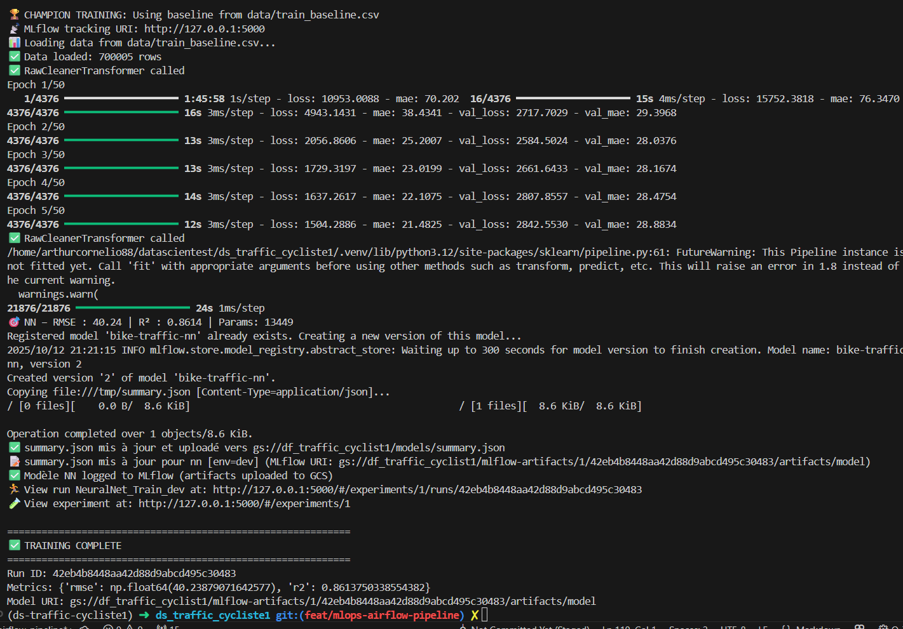
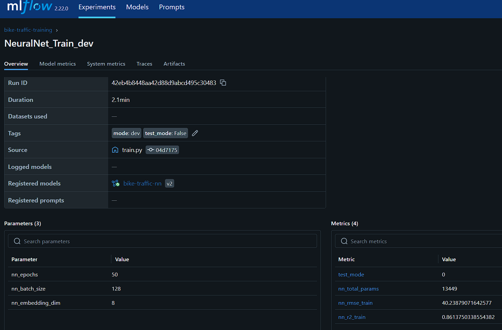
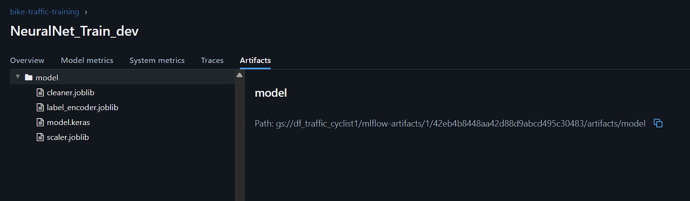
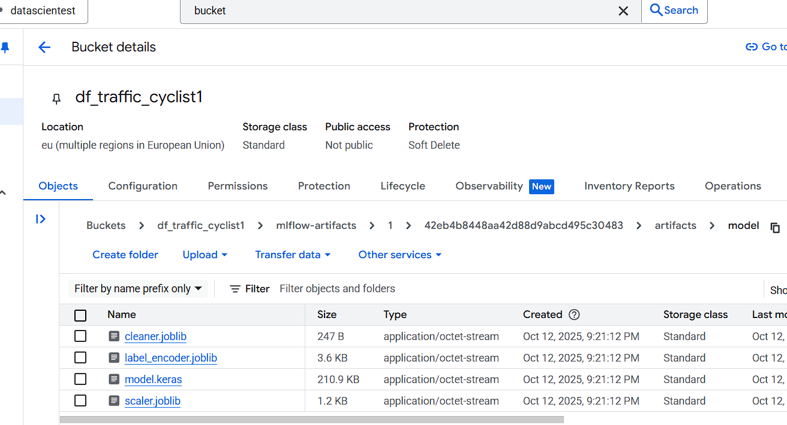
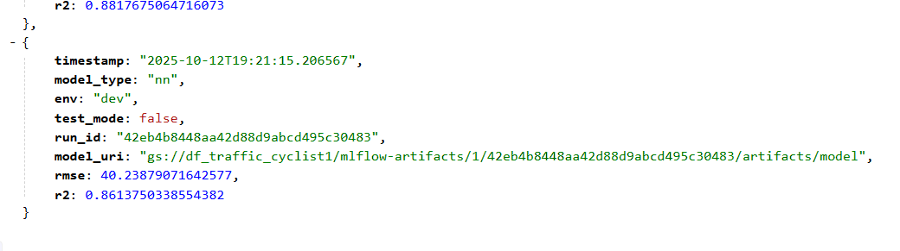
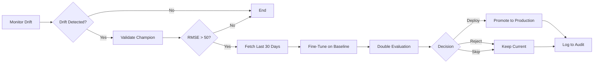

# Training Strategy — Champion Model + Intelligent Retraining

**Last Updated**: 2025-11-02

---

## Quick Start

| Task | Command |
|------|---------|
| **Train champion locally** | `python backend/regmodel/app/train.py --model-type rf --data-source baseline --env dev` |
| **Quick test (1K samples)** | `python backend/regmodel/app/train.py --model-type rf --data-source baseline --model-test --env dev` |
| **Trigger weekly fine-tuning** | `docker exec airflow-webserver airflow dags trigger monitor_and_fine_tune` |
| **View MLflow experiments** | <http://localhost:5000> |
| **Check audit logs** | BigQuery table: `monitoring_audit.logs` |

**Required Environment Variables:**

```bash
export TRAIN_DATA_PATH=gs://df_traffic_cyclist1/data/train_baseline.csv
export TEST_DATA_PATH=gs://df_traffic_cyclist1/data/test_baseline.csv
export GOOGLE_APPLICATION_CREDENTIALS=./mlflow-trainer.json
```

---

## Overview & Philosophy

The bike traffic prediction system uses a **champion model architecture** with intelligent retraining:

- **Champion models** are trained locally on comprehensive historical data (660K records)
- **Weekly fine-tuning** adapts models to recent patterns when drift is detected
- **Double test set evaluation** ensures models improve on new data without regressing on baseline performance
- **Quarterly retraining** incorporates accumulated production data into new baselines

### Core Principles

| Principle | Implementation |
|-----------|---------------|
| **Quality First** | Train champions on large datasets with full control |
| **Adaptive** | Weekly fine-tuning responds to distribution shifts |
| **Rigorous Evaluation** | Double test sets prevent both regression and overfitting |
| **Cost-Effective** | Local training (free GPU) + lightweight cloud fine-tuning |
| **Auditable** | Full lineage via MLflow + BigQuery audit logs |

---

## Double Test Set Evaluation

**Status**: Core feature (implemented 2025-11-02)

### Why Two Test Sets?

Double evaluation prevents deploying models that fit new data but lose generalization capability
(based on Sculley et al., "Hidden Technical Debt in Machine Learning Systems", NIPS 2015).

| Test Set | Purpose | Size | Threshold |
|----------|---------|------|-----------|
| **test_baseline** | Detect regression on known data | 132K samples (fixed) | R² >= 0.60 |
| **test_current** | Evaluate on new distribution | 20% of production data | Must improve vs. current champion |

### Decision Logic

```python
BASELINE_R2_THRESHOLD = 0.60

if metrics_baseline["r2"] < BASELINE_R2_THRESHOLD:
    decision = "reject_regression"
    # Model regressed - DO NOT DEPLOY

elif metrics_current["r2"] > production_model_r2:
    decision = "deploy"
    # Model improved - DEPLOY

else:
    decision = "skip_no_improvement"
    # No improvement - KEEP CURRENT MODEL
```

### Example Results

**Test case**: Intentional small-sample training to verify regression detection

| Metric | Training (964 rows) | test_baseline (132K) | test_current (38) | Decision |
|--------|---------------------|----------------------|-------------------|----------|
| RMSE   | 35.90               | 317.10               | 36.01             | Reject   |
| R²     | 0.882               | **0.051** 🚨         | 0.854             | ❌ Regression detected |

**Analysis**: Model fit training and current data well, but catastrophically failed on baseline.
Double evaluation correctly rejected deployment.

**Expected with full data** (`data_source="baseline"`, 660K samples):

- Baseline R²: 0.75-0.85 (no regression)
- Current R²: Compared against production champion
- Training time: 2-5 minutes

---

## Champion Training (Local)

**When**: Initial setup, quarterly refresh, major architecture changes

**Objective**: Create best possible baseline model on comprehensive historical data

### Data Sources

```bash
# Baseline datasets on GCS
TRAIN_DATA_PATH=gs://df_traffic_cyclist1/data/train_baseline.csv  # 660K rows
TEST_DATA_PATH=gs://df_traffic_cyclist1/data/test_baseline.csv    # 132K rows
```

### Training Commands

**Basic champion training:**

```bash
# RandomForest champion
python backend/regmodel/app/train.py \
    --model-type rf \
    --data-source baseline \
    --env dev

# Neural Network champion
python backend/regmodel/app/train.py \
    --model-type nn \
    --data-source baseline \
    --env dev
```

**Quick test (debugging):**

```bash
# Fast iteration on 1K sample (~10 seconds)
python backend/regmodel/app/train.py \
    --model-type rf \
    --data-source baseline \
    --model-test \
    --env dev
```

### CLI Parameters

| Parameter | Options | Description |
|-----------|---------|-------------|
| `--model-type` | `rf`, `nn`, `rf_class` | Model architecture (RandomForest, Neural Net, Classifier) |
| `--data-source` | `baseline`, `current`, `reference` | Training data origin (baseline recommended) |
| `--env` | `dev`, `prod` | Environment mode (both upload to GCS) |
| `--model-test` | flag | Quick test mode (1K sample) |

### Training Pipeline Steps

1. **Setup**: Load GCS credentials (`mlflow-trainer.json`)
2. **Data Loading**: Read from `$TRAIN_DATA_PATH` (GCS or local fallback)
3. **Training**: Fit custom pipeline (cleaning → feature engineering → model)

   
   *Figure 1: Neural Network training pipeline with custom transformers*

4. **Double Evaluation**:
   - Evaluate on **test_baseline.csv** (detect regression)
   - Evaluate on **test_current** (if provided, assess new distribution)
5. **MLflow Logging**:
   - Metadata → Cloud SQL PostgreSQL (experiments, runs, metrics)
   - Model registered in MLflow Registry (`bike-traffic-rf` version X)

   
   *Figure 2: MLflow UI showing experiment tracking and metrics*

   - Artifacts → `gs://df_traffic_cyclist1/mlflow-artifacts/{run_id}/`

   
   *Figure 3: MLflow artifact storage (cleaner, model, OHE, preprocessor)*

6. **GCS Artifact Storage**:

   ```text
   gs://df_traffic_cyclist1/
   ├── mlflow-artifacts/{experiment_id}/{run_id}/artifacts/model/
   └── models/summary.json
   ```

   
   *Figure 4: GCS bucket structure with MLflow artifacts*

7. **Summary Update**: `summary.json` appended with run metadata for Airflow

   
   *Figure 5: Example summary.json entry (timestamp, model_type, run_id, metrics)*

### Expected Metrics (Baseline Data)

| Model | RMSE | R² |
|-------|------|-----|
| **RandomForest** | ~47 | ~0.79 |
| **Neural Network** | ~54 | ~0.72 |

---

## Production Fine-Tuning (Automated)

**When**: Weekly via `dag_monitor_and_train.py` if drift detected

**Objective**: Adapt champion to recent patterns without full retraining

### Airflow DAG Workflow



**Trigger manually:**

```bash
docker exec airflow-webserver airflow dags trigger monitor_and_fine_tune
```

**Schedule**: @weekly (Sunday 00:00)

### API Fine-Tuning Call

```python
# dag_monitor_and_train.py
response = requests.post(
    f"{REGMODEL_API_URL}/train",
    json={
        "model_type": "rf",
        "data_source": "baseline",  # Train on full baseline
        "current_data": df_current.to_dict(orient='records'),  # Last 30 days
        "hyperparams": {
            "learning_rate": 0.001,  # Lower for fine-tuning
            "n_estimators": 50,
            "max_depth": 20
        },
        "test_mode": False
    },
    timeout=600
)
```

### Double Evaluation in Production

```python
# Automatic in DAG
result = response.json()

# Check regression
if result['baseline_regression']:
    log_event("fine_tune_rejected", "baseline regression detected")
    return

# Check improvement
if result['metrics_current']['r2'] > champion_r2:
    promote_to_production(result['model_uri'])
    log_event("champion_promoted", result['metrics_current'])
else:
    log_event("champion_kept", "no improvement on current distribution")
```

### DAG Flow Details

1. **Monitor**: Detect drift using Evidently
2. **Validate**: Check champion RMSE (threshold: 50)
3. **Decide**: If RMSE > 50, trigger fine-tuning
4. **Fine-tune**:
   - Fetch last 30 days from BigQuery (limit 2000 rows)
   - **Split current_data**: 80% training / 20% evaluation
   - **Sliding Window Training**: Concatenate train_baseline (660K samples) + train_current (80% of fresh data)
   - Train model on combined dataset (learns new compteurs!)
   - **Double Evaluation**:
     - test_baseline (181K samples, fixed reference)
     - test_current (20% of fetched data, new distribution)
5. **Decision**: Deploy/Reject/Skip based on double metrics
6. **Audit**: Log all metrics to BigQuery `monitoring_audit.logs`

---

## Quarterly Retraining

**When**: Every 3 months, or when performance degrades >20%

**Objective**: Incorporate accumulated production data into new baseline

### Data Aggregation

```bash
# 1. Export 3 months from BigQuery
bq extract --destination_format=CSV \
  'datascientest-460618:bike_traffic_raw.daily_*' \
  gs://df_traffic_cyclist1/exports/bq_export_*.csv

# 2. Download and merge
gsutil -m cp gs://df_traffic_cyclist1/data/train_baseline.csv data/
gsutil -m cp gs://df_traffic_cyclist1/exports/bq_export_*.csv data/exports/

python scripts/merge_baseline_bq.py \
    --baseline data/train_baseline.csv \
    --bq-export data/exports/bq_export_*.csv \
    --output data/new_train_baseline.csv
```

### Retrain from Scratch

```bash
# Train on merged dataset with double evaluation
python backend/regmodel/app/train.py \
    --model-type rf \
    --data-source baseline \
    --env dev

# If test_baseline metrics improved → upload as new baseline
gsutil cp data/new_train_baseline.csv \
  gs://df_traffic_cyclist1/data/train_baseline.csv

# Update Secret Manager reference
gcloud secrets versions add train-data-path \
  --data-file=- <<< "gs://df_traffic_cyclist1/data/train_baseline.csv"
```

---

## MLflow Integration

### Architecture

```text
┌──────────────────┐        ┌─────────────────────┐
│  Training Script │───────>│  MLflow Server      │
│  (train.py)      │        │  localhost:5000     │
└──────────────────┘        └─────────────────────┘
         │                            │
         │ Artifacts                  │ Metadata
         ↓                            ↓
┌──────────────────┐        ┌─────────────────────┐
│  GCS Bucket      │        │  Cloud SQL          │
│  mlflow-artifacts│        │  PostgreSQL         │
└──────────────────┘        └─────────────────────┘
```

### Key Components

| Component | Implementation | Details |
|-----------|---------------|---------|
| **Backend Store** | Cloud SQL PostgreSQL | Instance: `mlflow-metadata` (europe-west3) |
| **Artifact Store** | GCS | `gs://df_traffic_cyclist1/mlflow-artifacts/` |
| **Model Registry** | MLflow UI + summary.json | Human exploration + DAG automation |

### Authentication

**Training Script (Client):**

- Service Account: `mlflow-trainer@datascientest-460618.iam.gserviceaccount.com`
- Role: `roles/storage.objectAdmin`
- Credentials: `./mlflow-trainer.json`

**MLflow Server (Docker):**

1. **Cloud SQL Proxy** (`gcp.json`):
   - Service Account: `streamlit-models@datascientest-460618.iam.gserviceaccount.com`
   - Role: `roles/cloudsql.client`

2. **MLflow UI** (`mlflow-ui-access.json`):
   - Service Account: `mlflow-ui-access@datascientest-460618.iam.gserviceaccount.com`
   - Role: `roles/storage.objectViewer`

See [mlflow_cloudsql.md](./mlflow_cloudsql.md) for complete setup details.

### Dual Registry System

**1. MLflow Registry** (Rich UI, versioning)

- URL: <http://localhost:5000>
- Models: `bike-traffic-rf`, `bike-traffic-nn`
- Features: Version history, artifact lineage, metric comparison

**2. summary.json** (Airflow-compatible)

- Path: `gs://df_traffic_cyclist1/models/summary.json`
- Updated for ALL training runs (dev + prod)

```json
{
  "timestamp": "2025-11-02T15:37:11",
  "model_type": "rf",
  "env": "dev",
  "test_mode": false,
  "run_id": "35dc84a2ce7b427b8a3fded8435fef35",
  "model_uri": "gs://.../mlflow-artifacts/.../artifacts/model/",
  "rmse": 47.28,
  "r2": 0.7920,
  "double_evaluation_enabled": true,
  "r2_baseline": 0.79,
  "r2_current": 0.82,
  "baseline_regression": false
}
```

**Why both?** MLflow for human exploration, summary.json for programmatic access.

---

## Complete Workflows

### Local Champion Workflow

```text
┌───────────────────────────────────────────────────────────────┐
│ LOCAL CHAMPION TRAINING (Quarterly)                          │
├───────────────────────────────────────────────────────────────┤
│                                                               │
│  1. Merge historical + prod data → new_train_baseline.csv    │
│  2. python train.py --model-type rf --data-source baseline   │
│  3. ✅ Evaluate on test_baseline.csv (detect regression)     │
│  4. ✅ Evaluate on test_current (if provided)                │
│  5. Upload artifacts to gs://.../mlflow-artifacts/{run_id}/  │
│  6. Update summary.json with double eval metrics             │
│  7. Register in MLflow: bike-traffic-rf v{N}                 │
│                                                               │
│  Expected Metrics: RMSE ~47, R² ~0.79 (RandomForest)         │
│                                                               │
└───────────────────────────────────────────────────────────────┘
```

### Production Fine-Tuning Workflow

```text
┌───────────────────────────────────────────────────────────────┐
│ PRODUCTION FINE-TUNING (Weekly via Airflow)                  │
├───────────────────────────────────────────────────────────────┤
│                                                               │
│  1. dag_monitor_and_train.py triggers on drift alert         │
│  2. POST /train with last 30 days from BigQuery              │
│                                                               │
│  3. 🔄 SLIDING WINDOW TRAINING:                               │
│     a) Split current_data: 80% train / 20% test              │
│     b) Concatenate: train_baseline + train_current           │
│     c) Train model on COMBINED data (learns new compteurs!)  │
│     d) Result: Model adapts to new patterns + locations      │
│                                                               │
│  4. ✅ Evaluate on test_baseline.csv (R² >= 0.60?)           │
│  5. ✅ Evaluate on test_current (improvement?)               │
│                                                               │
│     Decision Logic:                                           │
│                                                               │
│     IF r2_baseline < 0.60:                                    │
│        → ❌ REJECT (baseline regression)                      │
│        → Log "fine_tune_rejected"                             │
│                                                               │
│     ELIF r2_current > champion_r2:                            │
│        → ✅ DEPLOY (improved on current distribution)         │
│        → Update summary.json [env=prod]                       │
│        → Log "champion_promoted"                              │
│                                                               │
│     ELSE:                                                     │
│        → ⏭️  SKIP (no improvement)                            │
│        → Log "champion_kept"                                  │
│                                                               │
└───────────────────────────────────────────────────────────────┘
```

### Decision Triggers

| Trigger | Action | Evaluation Strategy |
|---------|--------|---------------------|
| **Weekly drift detected** | Fine-tune on last 30 days | Double eval (baseline + current) |
| **Performance drop 10-20%** | Lightweight adaptation | Double eval (baseline + current) |
| **Performance drop >20%** | Full retrain locally | Double eval (baseline + current) |
| **Quarterly schedule** | Merge 3 months + retrain | Double eval (baseline only) |
| **New features available** | Experiment locally | Double eval (baseline only) |
| **Architecture change** | Full local development | Double eval (baseline only) |

---

## Manual Testing with Double Evaluation

### Via API

```python
import pandas as pd
import numpy as np
import requests

# Prepare 200+ samples from BigQuery or CSV
df_current = pd.read_csv('your_data.csv', sep=';').sample(n=200)

# Clean for JSON serialization
df_current = df_current.replace([np.inf, -np.inf], np.nan)
for col in df_current.columns:
    if df_current[col].dtype in ['float64', 'int64']:
        df_current[col] = df_current[col].fillna(0)
    else:
        df_current[col] = df_current[col].fillna('')

# Call API with double evaluation
payload = {
    "model_type": "rf",
    "data_source": "baseline",  # Use full train_baseline.csv
    "env": "dev",
    "current_data": df_current.to_dict(orient='records'),
    "test_mode": False
}

response = requests.post(
    "http://localhost:8000/train",
    json=payload,
    timeout=600
)

result = response.json()
print(f"Double eval enabled: {result['double_evaluation_enabled']}")
print(f"Baseline R²: {result['metrics_baseline']['r2']:.3f}")
print(f"Current R²: {result['metrics_current']['r2']:.3f}")
print(f"Regression detected: {result['baseline_regression']}")
print(f"Decision: {result.get('deployment_decision', 'N/A')}")
```

---

## Monitoring & Audit Trail

| Resource | Location | Contents |
|----------|----------|----------|
| **MLflow Experiments** | <http://localhost:5000> | All runs with double eval metrics |
| **BigQuery Audit** | `monitoring_audit.logs` | decision, baseline_regression, r2_baseline, r2_current |
| **Drift Reports** | `gs://df_traffic_cyclist1/drift_reports/` | Evidently HTML reports |
| **Model Registry** | MLflow UI + summary.json | Version history, lineage, metrics |

---

## Implementation Files

| File | Purpose |
|------|---------|
| `backend/regmodel/app/train.py` | Training logic, double evaluation, path resolution |
| `backend/regmodel/app/fastapi_app.py` | `/train` API endpoint |
| `dags/dag_monitor_and_train.py` | Airflow orchestration, `fine_tune_model()` |
| `scripts/create_reference_sample.py` | Generate test_current samples |

---

## Best Practices

### DO

- Always use double evaluation for production deployments
- Evaluate on `test_baseline.csv` (fixed test set) to detect regression
- Use R² >= 0.60 threshold on baseline (prevents catastrophic failures)
- Compare on `test_current` to ensure improvement on new distribution
- Log all decisions to `monitoring_audit.logs`
- Train on full `train_baseline.csv` (660K samples) for production models

### DON'T

- Train and evaluate on the same recent data
- Promote based on training metrics alone
- Skip baseline evaluation (regression can be silent)
- Ignore baseline_regression flag in API response
- Use small samples for production training (< 1000 rows)

---

## Summary

**Key Benefits:**

- **Champion + Intelligent Retraining**: High-quality baselines + adaptive fine-tuning
- **Double Evaluation**: Prevents both regression and overfitting
- **Cost-Effective**: Local GPU for heavy training, cloud for lightweight adaptation
- **Rigorous**: Fixed test set + new distribution evaluation
- **Auditable**: Full lineage via MLflow + BigQuery logs
- **Rollback-Ready**: Versioned models in registry

**Architecture Highlights:**

| Component | Implementation | Benefit |
|-----------|---------------|---------|
| **Champion Training** | Local GPU, 660K samples | High quality, no cloud cost |
| **Double Evaluation** | test_baseline + test_current | Prevents regression + ensures improvement |
| **Weekly Fine-Tuning** | Airflow + API, 30 days data | Fast adaptation to drift |
| **MLflow Integration** | Cloud SQL + GCS | Centralized tracking, team collaboration |
| **Audit Logging** | BigQuery + GCS | Full decision history, compliance |

---

## Testing & Debugging

### Test Mode

Use `test_mode=true` to skip loading large baseline dataset (300MB) during development:

```bash
# Quick test (~10 seconds)
docker exec airflow-webserver airflow dags trigger monitor_and_fine_tune \
  --conf '{"force_fine_tune": true, "test_mode": true}'

# Full test with baseline evaluation (~2-3 minutes)
docker exec airflow-webserver airflow dags trigger monitor_and_fine_tune \
  --conf '{"force_fine_tune": true, "test_mode": false}'
```

**Behavior**:

- `test_mode=true`: Skips `test_baseline.csv` evaluation (metrics = 0.0)
- `test_mode=false`: Full evaluation on 132K baseline samples

### Monitoring Audit Logs

Query BigQuery for deployment decisions:

```sql
SELECT
  timestamp,
  deployment_decision,
  r2_baseline,
  r2_current,
  r2_train,
  baseline_regression,
  model_improvement,
  model_uri
FROM `datascientest-460618.monitoring_audit.logs`
ORDER BY timestamp DESC
LIMIT 10;
```

---

**Related Documentation:**

- [secrets.md](./secrets.md) — GCS credentials and Secret Manager setup
- [bigquery_setup.md](./bigquery_setup.md) — Production data pipeline
- [dvc.md](./dvc.md) — Data versioning strategy
- [mlflow_cloudsql.md](./mlflow_cloudsql.md) — MLflow setup and troubleshooting
- [dags.md](./dags.md) — Airflow DAG documentation
- [MLOPS_ROADMAP.md](../MLOPS_ROADMAP.md) — Overall MLOps architecture
