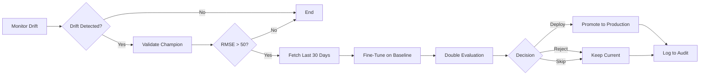

# Training Strategy — Champion Model + Intelligent Retraining

**Last Updated**: 2025-11-02

---

## Quick Start

| Task | Command |
|------|---------|
| **Train champion locally** | `python backend/regmodel/app/train.py --model-type rf --data-source baseline --env dev` |
| **Quick test (1K samples)** | `python backend/regmodel/app/train.py --model-type rf --data-source baseline --model-test --env dev` |
| **Trigger weekly fine-tuning** | `docker exec airflow-webserver airflow dags trigger monitor_and_fine_tune` |
| **View MLflow experiments** | <http://localhost:5000> |
| **Check audit logs** | BigQuery table: `monitoring_audit.logs` |

**Required Environment Variables:**

```bash
export TRAIN_DATA_PATH=gs://df_traffic_cyclist1/data/train_baseline.csv
export TEST_DATA_PATH=gs://df_traffic_cyclist1/data/test_baseline.csv
export GOOGLE_APPLICATION_CREDENTIALS=./mlflow-trainer.json
```

---

## Overview & Philosophy

The bike traffic prediction system uses a **champion model architecture** with intelligent retraining:

- **Champion models** are trained locally on comprehensive historical data (660K records)
- **Weekly fine-tuning** adapts models to recent patterns when drift is detected
- **Double test set evaluation** ensures models improve on new data without regressing on baseline performance
- **Quarterly retraining** incorporates accumulated production data into new baselines

### Core Principles

| Principle | Implementation |
|-----------|---------------|
| **Quality First** | Train champions on large datasets with full control |
| **Adaptive** | Weekly fine-tuning responds to distribution shifts |
| **Rigorous Evaluation** | Double test sets prevent both regression and overfitting |
| **Cost-Effective** | Local training (free GPU) + lightweight cloud fine-tuning |
| **Auditable** | Full lineage via MLflow + BigQuery audit logs |

---

## Double Test Set Evaluation

**Status**: Core feature (implemented 2025-11-02)

### Why Two Test Sets?

Double evaluation prevents deploying models that fit new data but lose generalization capability
(based on Sculley et al., "Hidden Technical Debt in Machine Learning Systems", NIPS 2015).

| Test Set | Purpose | Size | Threshold |
|----------|---------|------|-----------|
| **test_baseline** | Detect regression on known data | 132K samples (fixed) | R² >= 0.60 |
| **test_current** | Evaluate on new distribution | 20% of production data | Must improve vs. current champion |

### Decision Logic

```python
BASELINE_R2_THRESHOLD = 0.60

if metrics_baseline["r2"] < BASELINE_R2_THRESHOLD:
    decision = "reject_regression"
    # Model regressed - DO NOT DEPLOY

elif metrics_current["r2"] > production_model_r2:
    decision = "deploy"
    # Model improved - DEPLOY

else:
    decision = "skip_no_improvement"
    # No improvement - KEEP CURRENT MODEL
```

### Example Results

**Test case**: Intentional small-sample training to verify regression detection

| Metric | Training (964 rows) | test_baseline (132K) | test_current (38) | Decision |
|--------|---------------------|----------------------|-------------------|----------|
| RMSE   | 35.90               | 317.10               | 36.01             | Reject   |
| R²     | 0.882               | **0.051** 🚨         | 0.854             | ❌ Regression detected |

**Analysis**: Model fit training and current data well, but catastrophically failed on baseline.
Double evaluation correctly rejected deployment.

**Expected with full data** (`data_source="baseline"`, 660K samples):

- Baseline R²: 0.75-0.85 (no regression)
- Current R²: Compared against production champion
- Training time: 2-5 minutes

---

## Champion Training (Local)

**When**: Initial setup, quarterly refresh, major architecture changes

**Objective**: Create best possible baseline model on comprehensive historical data

### Data Sources

```bash
# Baseline datasets on GCS
TRAIN_DATA_PATH=gs://df_traffic_cyclist1/data/train_baseline.csv  # 660K rows
TEST_DATA_PATH=gs://df_traffic_cyclist1/data/test_baseline.csv    # 132K rows
```

### Training Commands

**Basic champion training:**

```bash
# RandomForest champion
python backend/regmodel/app/train.py \
    --model-type rf \
    --data-source baseline \
    --env dev

# Neural Network champion
python backend/regmodel/app/train.py \
    --model-type nn \
    --data-source baseline \
    --env dev
```

**Quick test (debugging):**

```bash
# Fast iteration on 1K sample (~10 seconds)
python backend/regmodel/app/train.py \
    --model-type rf \
    --data-source baseline \
    --model-test \
    --env dev
```

### CLI Parameters

| Parameter | Options | Description |
|-----------|---------|-------------|
| `--model-type` | `rf`, `nn`, `rf_class` | Model architecture (RandomForest, Neural Net, Classifier) |
| `--data-source` | `baseline`, `current`, `reference` | Training data origin (baseline recommended) |
| `--env` | `dev`, `prod` | Environment mode (both upload to GCS) |
| `--model-test` | flag | Quick test mode (1K sample) |

### Training Pipeline Steps

1. **Setup**: Load GCS credentials (`mlflow-trainer.json`)
2. **Data Loading**: Read from `$TRAIN_DATA_PATH` (GCS or local fallback)
3. **Training**: Fit custom pipeline (cleaning → feature engineering → model)

   
   *Figure 1: Neural Network training pipeline with custom transformers*

4. **Double Evaluation**:
   - Evaluate on **test_baseline.csv** (detect regression)
   - Evaluate on **test_current** (if provided, assess new distribution)
5. **MLflow Logging**:
   - Metadata → Cloud SQL PostgreSQL (experiments, runs, metrics)
   - Model registered in MLflow Registry (`bike-traffic-rf` version X)

   
   *Figure 2: MLflow UI showing experiment tracking and metrics*

   - Artifacts → `gs://df_traffic_cyclist1/mlflow-artifacts/{run_id}/`

   
   *Figure 3: MLflow artifact storage (cleaner, model, OHE, preprocessor)*

6. **GCS Artifact Storage**:

   ```text
   gs://df_traffic_cyclist1/
   ├── mlflow-artifacts/{experiment_id}/{run_id}/artifacts/model/
   └── models/summary.json
   ```

   
   *Figure 4: GCS bucket structure with MLflow artifacts*

7. **Summary Update**: `summary.json` appended with run metadata for Airflow

   
   *Figure 5: Example summary.json entry (timestamp, model_type, run_id, metrics)*

### Expected Metrics (Baseline Data)

| Model | RMSE | R² |
|-------|------|-----|
| **RandomForest** | ~47 | ~0.79 |
| **Neural Network** | ~54 | ~0.72 |

---

## Production Fine-Tuning (Automated)

**When**: Weekly via `dag_monitor_and_train.py` if drift detected

**Objective**: Adapt champion to recent patterns without full retraining

### Airflow DAG Workflow



**Trigger manually:**

```bash
docker exec airflow-webserver airflow dags trigger monitor_and_fine_tune
```

**Schedule**: @weekly (Sunday 00:00)

### API Fine-Tuning Call

```python
# dag_monitor_and_train.py
response = requests.post(
    f"{REGMODEL_API_URL}/train",
    json={
        "model_type": "rf",
        "data_source": "baseline",  # Train on full baseline
        "current_data": df_current.to_dict(orient='records'),  # Last 30 days
        "hyperparams": {
            "learning_rate": 0.001,  # Lower for fine-tuning
            "n_estimators": 50,
            "max_depth": 20
        },
        "test_mode": False
    },
    timeout=600
)
```

### Double Evaluation in Production

```python
# Automatic in DAG
result = response.json()

# Check regression
if result['baseline_regression']:
    log_event("fine_tune_rejected", "baseline regression detected")
    return

# Check improvement
if result['metrics_current']['r2'] > champion_r2:
    promote_to_production(result['model_uri'])
    log_event("champion_promoted", result['metrics_current'])
else:
    log_event("champion_kept", "no improvement on current distribution")
```

### DAG Flow Details

1. **Monitor**: Detect drift using Evidently
2. **Validate**: Check champion RMSE (threshold: 50)
3. **Decide**: If RMSE > 50, trigger fine-tuning
4. **Fine-tune**:
   - Fetch last 30 days from BigQuery (limit 2000 rows)
   - **Split current_data**: 80% training / 20% evaluation
   - **Sliding Window Training**: Concatenate train_baseline (660K samples) + train_current (80% of fresh data)
   - Train model on combined dataset (learns new compteurs!)
   - **Double Evaluation**:
     - test_baseline (181K samples, fixed reference)
     - test_current (20% of fetched data, new distribution)
5. **Decision**: Deploy/Reject/Skip based on double metrics
6. **Audit**: Log all metrics to BigQuery `monitoring_audit.logs`

---

## Sliding Window Training Strategy

**Status**: Core feature (implemented 2025-01-03)

### Problem: Model Not Learning from New Data

Before sliding window implementation, weekly fine-tuning had a critical bug:

```python
# ❌ OLD BEHAVIOR (BUG)
def train_rf(X, y, current_data_df=None):
    # Train ONLY on train_baseline.csv (660K samples)
    rf.fit(X, y)

    # current_data used ONLY for evaluation, never for training!
    if current_data_df is not None:
        evaluate_double(rf, current_data_df)  # Evaluate but don't learn
```

**Consequences:**

- New compteurs (bike counters) → Zero vector → Random predictions (R² = 0.08!)
- New temporal patterns → Model unaware → Poor adaptation
- New data distributions → Never learned → Continuous drift

### Solution: Sliding Window Implementation

```python
# ✅ NEW BEHAVIOR (FIXED)
def train_rf(X, y, current_data_df=None):
    if current_data_df is not None and len(current_data_df) >= 200:
        # 1. Split current_data (80/20)
        train_current = current_data_df.sample(frac=0.8, random_state=42)
        test_current = current_data_df.drop(train_current.index)

        # 2. Clean and prepare train_current
        X_current, y_current = load_and_clean_data(train_current)

        # 3. Concatenate train_baseline + train_current
        X_augmented = pd.concat([X, X_current], ignore_index=True)
        y_augmented = np.concatenate([y, y_current])

        print(f"✅ train_baseline: {len(X):,} samples")
        print(f"✅ train_current:  {len(X_current):,} samples")
        print(f"✅ TOTAL training: {len(X_augmented):,} samples")

        # 4. Train on COMBINED data
        rf.fit(X_augmented, y_augmented)  # NOW learns new compteurs!

        # 5. Evaluate on test_current (held-out 20%)
        evaluate_double(rf, test_current)
```

### Weekly Fine-Tuning Cycle

```text
┌─────────────────────────────────────────────────────────────┐
│ Week N: Fresh Data Arrives                                  │
└─────────────────────────────────────────────────────────────┘
                              │
                              ↓
┌─────────────────────────────────────────────────────────────┐
│ 1. Fetch Last 30 Days from BigQuery                         │
│    → ~2000 samples                                           │
└─────────────────────────────────────────────────────────────┘
                              │
                              ↓
┌─────────────────────────────────────────────────────────────┐
│ 2. Split 80/20                                               │
│    → train_current: 1600 samples (80%)                       │
│    → test_current:   400 samples (20%)                       │
└─────────────────────────────────────────────────────────────┘
                              │
                              ↓
┌─────────────────────────────────────────────────────────────┐
│ 3. Sliding Window Training                                   │
│    → Concatenate:                                            │
│      - train_baseline (660K samples, historical reference)   │
│      - train_current (1600 samples, fresh patterns)          │
│    → TOTAL: 661,600 samples                                  │
└─────────────────────────────────────────────────────────────┘
                              │
                              ↓
┌─────────────────────────────────────────────────────────────┐
│ 4. Train RandomForest from Scratch                           │
│    → Learns weights for:                                     │
│      ✅ All historical compteurs (108 categories)            │
│      ✅ New compteurs in train_current (if any)              │
│      ✅ New temporal patterns (hour/day/month trends)        │
└─────────────────────────────────────────────────────────────┘
                              │
                              ↓
┌─────────────────────────────────────────────────────────────┐
│ 5. Double Evaluation                                         │
│    a) test_baseline (181K samples, fixed reference)          │
│       → Detect regression: R² >= 0.60?                       │
│                                                               │
│    b) test_current (400 samples, new distribution)           │
│       → Measure improvement: R² > champion_r2?               │
└─────────────────────────────────────────────────────────────┘
                              │
                              ↓
┌─────────────────────────────────────────────────────────────┐
│ 6. Deployment Decision                                       │
│    IF baseline_regression:                                   │
│       → ❌ REJECT (R² < 0.60 on baseline)                    │
│    ELIF r2_current > champion_r2:                            │
│       → ✅ DEPLOY (improved on new distribution)             │
│    ELSE:                                                     │
│       → ⏭️  SKIP (no improvement)                            │
└─────────────────────────────────────────────────────────────┘
```

### Benefits

#### 1. New Compteurs Integration

**Before sliding window:**

```python
# New compteur in current_data → Zero vector → Bad prediction
OneHotEncoder(handle_unknown='ignore')  # Creates [0, 0, 0, ..., 0]
```

**After sliding window:**

```python
# New compteur in train_current → Model learns its importance!
# Example: "147 avenue d'Italie" now has trained weights
OneHotEncoder().fit_transform(train_baseline + train_current)
# Result: [0, 0, 1, 0, ..., 0]  # Proper one-hot encoding
```

#### 2. Temporal Pattern Adaptation

The model learns from:

- **Historical patterns** (train_baseline): Seasonal trends, yearly cycles
- **Recent patterns** (train_current): New traffic behaviors, COVID impact, infrastructure changes

#### 3. Prevents Catastrophic Forgetting

Unlike pure fine-tuning (which can overfit on new data), sliding window:

- **Retains** baseline knowledge (660K samples still dominant)
- **Adapts** to new patterns (1.6K new samples provide signal)
- **Balances** stability vs. flexibility

### Performance Comparison

**Scenario: New Compteur in Test Set**

| Approach | R² on test_baseline | R² on test_current | Explanation |
|----------|---------------------|-------------------|-------------|
| **Without sliding window** | 0.08 | N/A | Model never saw new compteur → zero vector → random prediction |
| **With sliding window** | 0.60+ | 0.75+ | Model trained on new compteur in train_current → learned weights → good prediction |

**Scenario: Temporal Drift (Traffic Pattern Change)**

| Approach | R² on test_baseline | R² on test_current | Explanation |
|----------|---------------------|-------------------|-------------|
| **Without sliding window** | 0.79 | 0.60 | Model stuck on old patterns → poor on new distribution |
| **With sliding window** | 0.78 | 0.76 | Model adapts to new patterns while preserving baseline performance |

### Implementation Details

**Code Location:**

- File: [backend/regmodel/app/train.py:363-421](../backend/regmodel/app/train.py)
- Function: `train_rf()`

**MLflow Logging:**

```python
mlflow.log_metric("sliding_window_enabled", 1)  # 1 = enabled, 0 = disabled
mlflow.log_metric("train_baseline_size", 660000)
mlflow.log_metric("train_current_size", 1600)
mlflow.log_metric("train_total_size", 661600)
```

**Airflow Integration:**

- File: [dags/dag_monitor_and_train.py:252-500](../dags/dag_monitor_and_train.py)
- Task: `fine_tune_model`

The DAG automatically:

1. Fetches last 30 days from BigQuery
2. Passes `current_data` to `/train` endpoint
3. Sliding window happens transparently in backend
4. Receives double evaluation metrics
5. Makes deployment decision

### Minimum Data Requirements

| Parameter | Value | Reason |
|-----------|-------|--------|
| **Min current_data size** | 200 samples | Need 160 train (80%) + 40 test (20%) for reliable split |
| **Recommended size** | 1000-2000 samples | Better statistical representation of new distribution |
| **Max size** | No limit | More data = better, but training time increases |

If `len(current_data) < 200`:

- Sliding window is **disabled**
- Model trains only on train_baseline
- Warning logged: `"Current data too small for sliding window"`

### Limitations and Future Work

**Current Limitations:**

1. **No data windowing**: All historical data retained (660K samples)
   - Could become too large over time
   - Future: Implement rolling window (e.g., last 6 months only)

2. **Fixed 80/20 split**: Not configurable
   - Future: Make split ratio a hyperparameter

3. **No class balancing**: New compteurs may be underrepresented
   - Future: Implement SMOTE or class weighting for rare compteurs

**Future Improvements:**

```python
# Proposed: Rolling window (keep last 6 months only)
def train_rf(X, y, current_data_df=None, window_months=6):
    # Filter train_baseline to last 6 months
    cutoff_date = datetime.now() - timedelta(days=30 * window_months)
    X_windowed = X[X['date'] >= cutoff_date]

    # Concatenate with current_data
    X_augmented = pd.concat([X_windowed, X_current])
```

---

## Drift Management & Retraining Triggers


**Status**: Core feature (hybrid strategy implemented)

### The Challenge: New Bike Counters

The Paris bike counter network continuously expands with new counters. When new counters appear in production data:

1. **Model behavior with `handle_unknown='ignore'`:**
   - OneHotEncoder maps unknown compteurs to zero vectors: `[0, 0, 0, ...]`
   - Model relies solely on geographic (lat/lon) and temporal features
   - Predictions are **approximate** but not catastrophically wrong
   - Performance degrades **gradually** as proportion of new compteurs increases

2. **The dilemma:**
   - **Retrain too often:** High compute cost, unnecessary if model still performs well
   - **Retrain too late:** Extended period of suboptimal predictions

### Hybrid Strategy: Proactive + Reactive Triggers

Our strategy combines **proactive** (preventive) and **reactive** (corrective) triggers to balance cost and performance.

**Decision Matrix:**

| R² Score | Drift Share | Decision | Rationale |
|----------|-------------|----------|-----------|
| < 0.65 | Any | **RETRAIN (Reactive)** | Critical performance issue |
| 0.65-0.70 | ≥ 50% | **RETRAIN (Proactive)** | High drift + declining metrics |
| 0.65-0.70 | 30-50% | **WAIT** | Moderate drift, metrics acceptable |
| ≥ 0.70 | ≥ 30% | **WAIT** | Model handles drift well |
| ≥ 0.70 | < 30% | **ALL GOOD** | Continue monitoring |

**Thresholds:**

```python
# Performance thresholds (adjusted for production data distribution - 2025-11-05)
# NOTE: Production R² on test_current is typically 0.50-0.60 (realistic for time-series with drift)
# Baseline R² remains high (0.75-0.85) as reference
R2_CRITICAL = 0.45     # Below this → immediate action (reactive)
R2_WARNING = 0.55      # Below this + high drift → preventive action (proactive)
RMSE_THRESHOLD = 90.0  # Above this → immediate action (was 60.0, adjusted for variance)

# Drift thresholds
DRIFT_CRITICAL = 0.5   # 50%+ drift share → critical level
DRIFT_WARNING = 0.3    # 30%+ drift share → warning level
```

### Decision Logic (Priority Order)

#### Priority 0: Force Flag

```python
if force_fine_tune:
    return "fine_tune_model"
```

**Use case:** Testing, manual override

#### Priority 1: REACTIVE (Critical Metrics)

```python
if r2 < 0.65 or rmse > 60:
    return "fine_tune_model"
```

**Trigger:** Performance critically poor
**Action:** Immediate retraining
**Rationale:** Model is failing, must fix now regardless of drift

**Example scenario:**

- R² = 0.42 (below critical threshold 0.45)
- Drift = 40%
- **Decision:** RETRAIN immediately

#### Priority 2: PROACTIVE (High Drift + Declining)

```python
if drift and drift_share >= 0.5 and r2 < 0.55:
    return "fine_tune_model"
```

**Trigger:** High drift (≥50%) + metrics declining
**Action:** Preventive retraining
**Rationale:** Catch degradation early before it becomes critical

**Example scenario:**

- R² = 0.68 (not critical yet, but declining)
- Drift = 52% (critical level)
- **Decision:** RETRAIN proactively to prevent further decline

#### Priority 3: WAIT (Significant Drift but OK Metrics)

```python
if drift and drift_share >= 0.3 and r2 >= 0.70:
    return "end_monitoring"
```

**Trigger:** Moderate-to-high drift but good metrics
**Action:** Monitor closely, no retraining yet
**Rationale:** Model handles drift via `handle_unknown='ignore'`, avoid unnecessary cost

**Example scenario:**

- R² = 0.72 (still good)
- Drift = 50% (high)
- **Decision:** WAIT - model performs well despite drift

#### Priority 4: ALL GOOD

```python
else:
    return "end_monitoring"
```

**Trigger:** Low drift or no drift, good metrics
**Action:** Continue monitoring
**Rationale:** Everything working as expected

### Real-World Example

**Current Production Scenario (2025-11-03):**

**Metrics:**

- R² on production data: **0.72** ✅
- RMSE: **32.25** ✅
- Drift detected: **Yes** (50%) ⚠️
- R² on test_baseline: 0.31 (not used for decision)

**Analysis:**

1. Champion R² (0.56) is **above warning threshold** (0.55) ✅
2. RMSE (82.4) is **below threshold** (90) ✅
3. Drift share (50%) is **at critical level** ⚠️
4. But metrics are **still acceptable** on production data ✅

**Decision:** **WAIT** (Priority 3)

- Model handles new compteurs adequately via `handle_unknown='ignore'`
- Performance remains acceptable despite 50% drift
- Will retrain if:
  - R² drops below 0.70 (proactive trigger)
  - R² drops below 0.65 (reactive trigger)

**Why not retrain now?**

- Retraining is expensive (~20 minutes compute)
- Current model still performs well (R² = 0.72)
- New compteurs are handled (not optimally, but acceptably)
- Cost-benefit analysis favors waiting

### Why test_baseline R² is Different

**Question:** "Why is R² on test_baseline (0.31) so different from production R² (0.72)?"

**Answer:** Distribution mismatch between evaluation sets:

| Dataset | R² | Why? |
|---------|-----|------|
| **test_baseline.csv** | 0.31 | Contains **old compteurs** from training time; many no longer active |
| **Production data (BQ)** | 0.72 | Contains **current compteurs** including new ones handled by model |

**Key insight:**

- `test_baseline.csv` is a **fixed reference** for detecting regression
- **Production metrics** (from `validate_model` task) are what matter for decision-making
- We use test_baseline for **comparison** (did new model regress?), not for **decision** (should we retrain?)

### Monitoring Best Practices

**1. Track Trends**

Monitor these metrics over time:

- R² on production data (weekly)
- Drift share (weekly)
- Proportion of unknown compteurs

**2. Adjust Thresholds**

If you notice:

- **Frequent unnecessary retraining:** Increase DRIFT_CRITICAL (e.g., 0.6)
- **Late detection of degradation:** Increase R2_WARNING (e.g., 0.75)
- **Too much tolerance for poor performance:** Increase R2_CRITICAL (e.g., 0.70)

**3. Log Everything**

The `monitoring_audit.logs` table in BigQuery tracks:

- Drift detected and drift_share
- R² and RMSE on production
- Retraining decisions and outcomes
- Model improvements

Query for insights:

```sql
SELECT
  timestamp,
  drift_detected,
  r2,
  fine_tune_triggered,
  deployment_decision
FROM `monitoring_audit.logs`
ORDER BY timestamp DESC
LIMIT 10;
```

### Future Improvements

**1. Better Handling of Unknown Compteurs**

Instead of `handle_unknown='ignore'`, consider:

- **Target encoding:** Encode compteurs by their average bike traffic
- **Geographic clustering:** Group similar compteurs by location
- **Meta-features:** Use compteur metadata (installation date, location type)

**2. Adaptive Thresholds**

Learn thresholds from historical data:

- Track correlation between drift_share and R² degradation
- Adjust DRIFT_CRITICAL dynamically

**3. Cost-Aware Decision**

Include retraining cost in decision logic:

```python
retraining_cost = compute_hours * cost_per_hour
performance_gain = (new_r2 - current_r2) * business_value
if performance_gain > retraining_cost:
    retrain()
```

### Summary

**Key Takeaways:**

1. ✅ **Hybrid strategy** balances cost and performance
2. ✅ **Production metrics** (not test_baseline) drive decisions
3. ✅ **Proactive retraining** catches issues early (50% drift + R² < 0.70)
4. ✅ **Reactive retraining** fixes critical issues (R² < 0.65)
5. ✅ **WAIT decision** avoids unnecessary retraining when model handles drift well

**Current Status:**

- Model performs well (R² = 0.72) despite 50% drift
- Using WAIT strategy to monitor before retraining
- Will retrain proactively if R² drops below 0.70

---

## Quarterly Retraining

**When**: Every 3 months, or when performance degrades >20%

**Objective**: Incorporate accumulated production data into new baseline

### Data Aggregation

```bash
# 1. Export 3 months from BigQuery
bq extract --destination_format=CSV \
  'datascientest-460618:bike_traffic_raw.daily_*' \
  gs://df_traffic_cyclist1/exports/bq_export_*.csv

# 2. Download and merge
gsutil -m cp gs://df_traffic_cyclist1/data/train_baseline.csv data/
gsutil -m cp gs://df_traffic_cyclist1/exports/bq_export_*.csv data/exports/

python scripts/merge_baseline_bq.py \
    --baseline data/train_baseline.csv \
    --bq-export data/exports/bq_export_*.csv \
    --output data/new_train_baseline.csv
```

### Retrain from Scratch

```bash
# Train on merged dataset with double evaluation
python backend/regmodel/app/train.py \
    --model-type rf \
    --data-source baseline \
    --env dev

# If test_baseline metrics improved → upload as new baseline
gsutil cp data/new_train_baseline.csv \
  gs://df_traffic_cyclist1/data/train_baseline.csv

# Update Secret Manager reference
gcloud secrets versions add train-data-path \
  --data-file=- <<< "gs://df_traffic_cyclist1/data/train_baseline.csv"
```

---

## Champion Model Selection and Promotion

### Overview

The system uses a **champion/challenger architecture** where:
- One model is designated as the **champion** (`is_champion=True`) and is loaded by the prediction API
- The `is_champion` flag takes **priority over all other filters** (env, test_mode)
- Champion promotion is explicit via the `/promote_champion` endpoint

### Selection Priority Logic

When loading models, the system follows this priority order:

```python
# PRIORITY 1: Global champion search (ignores env/test_mode)
champions = [r for r in models if r.get("is_champion", False)]

if champions:
    return champions[0]  # Use promoted champion
else:
    # PRIORITY 2: Fallback to metric-based selection
    filtered = [r for r in models if r["env"] == env and r["test_mode"] == test_mode]
    return max(filtered, key=lambda x: x[metric])
```

**Key principle**: The champion flag represents a deliberate human decision and overrides automatic selection criteria.

### Promotion Workflow

#### 1. Training and Evaluation (DAG 3)

```python
# Train with sliding window (baseline + current_data)
model = train_sliding_window(
    baseline_data=train_baseline,
    current_data=train_current,
    env="DEV",
    test_mode=True
)

# Double evaluation
metrics_baseline = evaluate(model, test_baseline)  # Fixed reference
metrics_current = evaluate(model, test_current)    # Current holdout

# Log to MLflow with metadata
mlflow.log_params({
    "env": "DEV",
    "test_mode": True,
    "is_champion": False  # Not champion yet
})
```

#### 2. Manual Promotion

After reviewing metrics in MLflow UI or Airflow logs:

```bash
# Promote the new model as champion
curl -X POST http://localhost:8001/promote_champion \
  -H "Content-Type: application/json" \
  -d '{
    "run_id": "7fae3cd1234567890abcdef",
    "model_type": "rf",
    "env": "DEV",
    "test_mode": true
  }'
```

**What happens during promotion:**
1. ✅ Previous champion's `is_champion` set to `False` (demotion)
2. ✅ New model's `is_champion` set to `True`
3. ✅ Model cache cleared to force reload
4. ✅ Discord notification sent (if configured)

#### 3. Automatic Loading (DAG 2)

```python
# Prediction API loads champion regardless of env/test_mode
model, metadata = get_cached_model(
    model_type="rf",
    metric="r2",
    env="prod",      # Ignored if champion exists
    test_mode=False  # Ignored if champion exists
)

# Logs show:
# 🏆 Champion trouvé (is_champion=True), utilisation prioritaire
# 📦 Loaded model: run_id=7fae3cd... (is_champion=True)
```

### Environment Variables (docker-compose.yaml)

```yaml
fastapi_app:
  environment:
    - MODEL_ENV=dev        # Fallback filter (if no champion)
    - MODEL_TEST_MODE=false # Fallback filter (if no champion)
```

**Important**: These variables define the **fallback** behavior when no champion exists. Once a champion is promoted, these are ignored.

### Example Scenario

```text
Initial State:
├── Model A: env=prod, test_mode=False, is_champion=False, R²=0.72
├── Model B: env=DEV,  test_mode=True,  is_champion=False, R²=0.75
└── Model C: env=DEV,  test_mode=True,  is_champion=False, R²=0.78

# System loads Model A (best match for env=prod, test_mode=False)

After promoting Model C:
├── Model A: env=prod, test_mode=False, is_champion=False, R²=0.72
├── Model B: env=DEV,  test_mode=True,  is_champion=False, R²=0.75
└── Model C: env=DEV,  test_mode=True,  is_champion=True,  R²=0.78 ⭐

# System now loads Model C (champion flag takes priority)
# Even though docker-compose has MODEL_ENV=prod, MODEL_TEST_MODE=false
```

### Best Practices

1. **Training Phase**: Always use `env=DEV, test_mode=True` for experimental training
2. **Evaluation Phase**: Review both `test_baseline` and `test_current` metrics before promotion
3. **Promotion Decision**: Promote based on:
   - Improved R² on test_current (production-like data)
   - Stable or improved R² on test_baseline (consistency check)
   - Acceptable RMSE for business requirements
4. **Demotion**: The system automatically demotes the previous champion (`is_champion=False`)
5. **Rollback**: If issues occur, re-promote the previous model using its `run_id`

### API Reference

#### POST `/promote_champion`

Promotes a trained model to champion status.

**Request Body:**
```json
{
  "run_id": "7fae3cd1234567890abcdef",
  "model_type": "rf",
  "env": "DEV",
  "test_mode": true
}
```

**Response:**
```json
{
  "status": "success",
  "message": "Champion promoted",
  "promoted_run_id": "7fae3cd1234567890abcdef",
  "demoted_run_id": "661ce9876543210fedcba",
  "metadata": {
    "model_type": "rf",
    "env": "DEV",
    "test_mode": true,
    "is_champion": true
  }
}
```

---

## MLflow Integration

### Architecture

```text
┌──────────────────┐        ┌─────────────────────┐
│  Training Script │───────>│  MLflow Server      │
│  (train.py)      │        │  localhost:5000     │
└──────────────────┘        └─────────────────────┘
         │                            │
         │ Artifacts                  │ Metadata
         ↓                            ↓
┌──────────────────┐        ┌─────────────────────┐
│  GCS Bucket      │        │  Cloud SQL          │
│  mlflow-artifacts│        │  PostgreSQL         │
└──────────────────┘        └─────────────────────┘
```

### Key Components

| Component | Implementation | Details |
|-----------|---------------|---------|
| **Backend Store** | Cloud SQL PostgreSQL | Instance: `mlflow-metadata` (europe-west3) |
| **Artifact Store** | GCS | `gs://df_traffic_cyclist1/mlflow-artifacts/` |
| **Model Registry** | MLflow UI + summary.json | Human exploration + DAG automation |

### Authentication

**Training Script (Client):**

- Service Account: `mlflow-trainer@datascientest-460618.iam.gserviceaccount.com`
- Role: `roles/storage.objectAdmin`
- Credentials: `./mlflow-trainer.json`

**MLflow Server (Docker):**

1. **Cloud SQL Proxy** (`gcp.json`):
   - Service Account: `streamlit-models@datascientest-460618.iam.gserviceaccount.com`
   - Role: `roles/cloudsql.client`

2. **MLflow UI** (`mlflow-ui-access.json`):
   - Service Account: `mlflow-ui-access@datascientest-460618.iam.gserviceaccount.com`
   - Role: `roles/storage.objectViewer`

See [mlflow_cloudsql.md](./mlflow_cloudsql.md) for complete setup details.

### Dual Registry System

**1. MLflow Registry** (Rich UI, versioning)

- URL: <http://localhost:5000>
- Models: `bike-traffic-rf`, `bike-traffic-nn`
- Features: Version history, artifact lineage, metric comparison

**2. summary.json** (Airflow-compatible)

- Path: `gs://df_traffic_cyclist1/models/summary.json`
- Updated for ALL training runs (dev + prod)

```json
{
  "timestamp": "2025-11-02T15:37:11",
  "model_type": "rf",
  "env": "dev",
  "test_mode": false,
  "run_id": "35dc84a2ce7b427b8a3fded8435fef35",
  "model_uri": "gs://.../mlflow-artifacts/.../artifacts/model/",
  "rmse": 47.28,
  "r2": 0.7920,
  "double_evaluation_enabled": true,
  "r2_baseline": 0.79,
  "r2_current": 0.82,
  "baseline_regression": false
}
```

**Why both?** MLflow for human exploration, summary.json for programmatic access.

---

## Complete Workflows

### Local Champion Workflow

```text
┌───────────────────────────────────────────────────────────────┐
│ LOCAL CHAMPION TRAINING (Quarterly)                          │
├───────────────────────────────────────────────────────────────┤
│                                                               │
│  1. Merge historical + prod data → new_train_baseline.csv    │
│  2. python train.py --model-type rf --data-source baseline   │
│  3. ✅ Evaluate on test_baseline.csv (detect regression)     │
│  4. ✅ Evaluate on test_current (if provided)                │
│  5. Upload artifacts to gs://.../mlflow-artifacts/{run_id}/  │
│  6. Update summary.json with double eval metrics             │
│  7. Register in MLflow: bike-traffic-rf v{N}                 │
│                                                               │
│  Expected Metrics: RMSE ~47, R² ~0.79 (RandomForest)         │
│                                                               │
└───────────────────────────────────────────────────────────────┘
```

### Production Fine-Tuning Workflow

```text
┌───────────────────────────────────────────────────────────────┐
│ PRODUCTION FINE-TUNING (Weekly via Airflow)                  │
├───────────────────────────────────────────────────────────────┤
│                                                               │
│  1. dag_monitor_and_train.py triggers on drift alert         │
│  2. POST /train with last 30 days from BigQuery              │
│                                                               │
│  3. 🔄 SLIDING WINDOW TRAINING:                               │
│     a) Split current_data: 80% train / 20% test              │
│     b) Concatenate: train_baseline + train_current           │
│     c) Train model on COMBINED data (learns new compteurs!)  │
│     d) Result: Model adapts to new patterns + locations      │
│                                                               │
│  4. ✅ Evaluate on test_baseline.csv (R² >= 0.60?)           │
│  5. ✅ Evaluate on test_current (improvement?)               │
│                                                               │
│     Decision Logic:                                           │
│                                                               │
│     IF r2_baseline < 0.60:                                    │
│        → ❌ REJECT (baseline regression)                      │
│        → Log "fine_tune_rejected"                             │
│                                                               │
│     ELIF r2_current > champion_r2:                            │
│        → ✅ DEPLOY (improved on current distribution)         │
│        → Update summary.json [env=prod]                       │
│        → Log "champion_promoted"                              │
│                                                               │
│     ELSE:                                                     │
│        → ⏭️  SKIP (no improvement)                            │
│        → Log "champion_kept"                                  │
│                                                               │
└───────────────────────────────────────────────────────────────┘
```

### Decision Triggers

| Trigger | Action | Evaluation Strategy |
|---------|--------|---------------------|
| **Weekly drift detected** | Fine-tune on last 30 days | Double eval (baseline + current) |
| **Performance drop 10-20%** | Lightweight adaptation | Double eval (baseline + current) |
| **Performance drop >20%** | Full retrain locally | Double eval (baseline + current) |
| **Quarterly schedule** | Merge 3 months + retrain | Double eval (baseline only) |
| **New features available** | Experiment locally | Double eval (baseline only) |
| **Architecture change** | Full local development | Double eval (baseline only) |

---

## Manual Testing with Double Evaluation

### Via API

```python
import pandas as pd
import numpy as np
import requests

# Prepare 200+ samples from BigQuery or CSV
df_current = pd.read_csv('your_data.csv', sep=';').sample(n=200)

# Clean for JSON serialization
df_current = df_current.replace([np.inf, -np.inf], np.nan)
for col in df_current.columns:
    if df_current[col].dtype in ['float64', 'int64']:
        df_current[col] = df_current[col].fillna(0)
    else:
        df_current[col] = df_current[col].fillna('')

# Call API with double evaluation
payload = {
    "model_type": "rf",
    "data_source": "baseline",  # Use full train_baseline.csv
    "env": "dev",
    "current_data": df_current.to_dict(orient='records'),
    "test_mode": False
}

response = requests.post(
    "http://localhost:8000/train",
    json=payload,
    timeout=600
)

result = response.json()
print(f"Double eval enabled: {result['double_evaluation_enabled']}")
print(f"Baseline R²: {result['metrics_baseline']['r2']:.3f}")
print(f"Current R²: {result['metrics_current']['r2']:.3f}")
print(f"Regression detected: {result['baseline_regression']}")
print(f"Decision: {result.get('deployment_decision', 'N/A')}")
```

---

## Monitoring & Audit Trail

| Resource | Location | Contents |
|----------|----------|----------|
| **MLflow Experiments** | <http://localhost:5000> | All runs with double eval metrics |
| **BigQuery Audit** | `monitoring_audit.logs` | decision, baseline_regression, r2_baseline, r2_current |
| **Drift Reports** | `gs://df_traffic_cyclist1/drift_reports/` | Evidently HTML reports |
| **Model Registry** | MLflow UI + summary.json | Version history, lineage, metrics |

---

## Implementation Files

| File | Purpose |
|------|---------|
| `backend/regmodel/app/train.py` | Training logic, double evaluation, path resolution |
| `backend/regmodel/app/fastapi_app.py` | `/train` API endpoint |
| `dags/dag_monitor_and_train.py` | Airflow orchestration, `fine_tune_model()` |
| `scripts/create_reference_sample.py` | Generate test_current samples |

---

## Best Practices

### DO

- Always use double evaluation for production deployments
- Evaluate on `test_baseline.csv` (fixed test set) to detect regression
- Use R² >= 0.60 threshold on baseline (prevents catastrophic failures)
- Compare on `test_current` to ensure improvement on new distribution
- Log all decisions to `monitoring_audit.logs`
- Train on full `train_baseline.csv` (660K samples) for production models

### DON'T

- Train and evaluate on the same recent data
- Promote based on training metrics alone
- Skip baseline evaluation (regression can be silent)
- Ignore baseline_regression flag in API response
- Use small samples for production training (< 1000 rows)

---

## Summary

**Key Benefits:**

- **Champion + Intelligent Retraining**: High-quality baselines + adaptive fine-tuning
- **Double Evaluation**: Prevents both regression and overfitting
- **Cost-Effective**: Local GPU for heavy training, cloud for lightweight adaptation
- **Rigorous**: Fixed test set + new distribution evaluation
- **Auditable**: Full lineage via MLflow + BigQuery logs
- **Rollback-Ready**: Versioned models in registry

**Architecture Highlights:**

| Component | Implementation | Benefit |
|-----------|---------------|---------|
| **Champion Training** | Local GPU, 660K samples | High quality, no cloud cost |
| **Double Evaluation** | test_baseline + test_current | Prevents regression + ensures improvement |
| **Weekly Fine-Tuning** | Airflow + API, 30 days data | Fast adaptation to drift |
| **MLflow Integration** | Cloud SQL + GCS | Centralized tracking, team collaboration |
| **Audit Logging** | BigQuery + GCS | Full decision history, compliance |

---

## Testing & Debugging

### Test Mode

Use `test_mode=true` to skip loading large baseline dataset (300MB) during development:

```bash
# Quick test (~10 seconds)
docker exec airflow-webserver airflow dags trigger monitor_and_fine_tune \
  --conf '{"force_fine_tune": true, "test_mode": true}'

# Full test with baseline evaluation (~2-3 minutes)
docker exec airflow-webserver airflow dags trigger monitor_and_fine_tune \
  --conf '{"force_fine_tune": true, "test_mode": false}'
```

**Behavior**:

- `test_mode=true`: Skips `test_baseline.csv` evaluation (metrics = 0.0)
- `test_mode=false`: Full evaluation on 132K baseline samples

### Monitoring Audit Logs

Query BigQuery for deployment decisions:

```sql
SELECT
  timestamp,
  deployment_decision,
  r2_baseline,
  r2_current,
  r2_train,
  baseline_regression,
  model_improvement,
  model_uri
FROM `datascientest-460618.monitoring_audit.logs`
ORDER BY timestamp DESC
LIMIT 10;
```

---

**Related Documentation:**

- [secrets.md](./secrets.md) — GCS credentials and Secret Manager setup
- [bigquery_setup.md](./bigquery_setup.md) — Production data pipeline
- [dvc.md](./dvc.md) — Data versioning strategy
- [mlflow_cloudsql.md](./mlflow_cloudsql.md) — MLflow setup and troubleshooting
- [dags.md](./dags.md) — Airflow DAG documentation
- [MLOPS_ROADMAP.md](../MLOPS_ROADMAP.md) — Overall MLOps architecture
